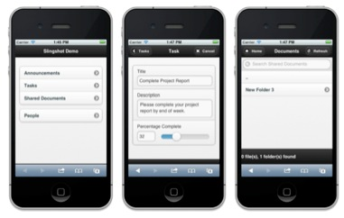

Getting SharePoint working on a mobile device can be hard. The “out of the box” experience, even with SharePoint 2010, is very basic and doesn’t take advantage of the device. Solutions on the AppStore are a step in the right direction, but many don’t do anything over providing the ability to browse a SharePoint site. At Neudesic, we are hoping to change all this through a project we call [Slingshot](http://neudesic.github.com/slingshot).

  
Slingshot is an open source mobile client and library for SharePoint. Built upon the jQuery Mobile and Apache Cordova frameworks, Slingshot makes it ridiculously easy to expose tasks, announcements, documents, and virtually any other object directly from SharePoint to any mobile device.
  

  
We demonstrated Slingshot for the first time in public at the SharePointFest in Denver this week, and the response has been tremendous. For those that didn’t make it to the event, I wanted to use this blog post to expand on what the framework can do.
  
Slingshot is very lightweight, and can be deployed in one of two ways: The code can run on the SharePoint server, and users access it using their mobile browser. Alternatively the same code can run on the mobile device in a native application, with no changes required on the SharePoint server.
  
Here’s a quick run through of what Slingshot supports today:
  
**SharePoint Lists and Items**
  
Slingshot uses the ODATA support in SharePoint 2010 to expose virtually any list or item to the mobile device. The out of the box demo shows announcements, tasks, and organizational details, and it’s easy to extend to workflows and other lists. Each of these items can be exposed through a form with touch native controls.  For example, task items have a slider control to indicate percentage complete.
  
**Bi-Directional Updates**
  
The sample app also demonstrates bi-directional updating. Update an item from SharePoint UI, and it automatically gets updated on the mobile device. Alternatively, update on the mobile device and the item is automatically updated in SharePoint. This update is seamless, so the user doesn’t have to hit “save” after making the change on the mobile device.
  
**Document Library Support**
  
One of the core scenarios for using Slingshot is to browse document libraries, which Slingshot handles really well. Supported file types (such as PDFs) can also be opened directly from the mobile app.
  
**Integration with Photo Capture**

Browsing and opening files from a mobile device is useful, but Slingshot also supports uploading data from the device. The majority of phones now come with a camera. The sample application shows how to take a photo on the device and upload it to a document library or attach it to an item. We find this functionality well suited for field employees who need to interact with workflows that involve taking pictures and uploading them to SharePoint.
  
**Support for Offline Scenarios**

Because Slingshot works locally on the device it enables a number of offline scenarios. Currently the application has the ability to work offline, and we are working on synchronization of SharePoint lists and items to the device, which will provide a true offline experience if no connection is available.
  
**Authentication**
  
Authentication works in one of two ways. If you are accessing Slingshot via a mobile browser, the browser will prompt for credentials (the same way as if you'd just navigated to any other SharePoint page). If you are running Slingshot locally on the device, we use a form-based mechanism that can be customized and extended as needed.
  
**Multi Platform Support**
  
Because we've developed all of this using jQuery Mobile and Cordova (PhoneGap), it is supported on multiple platforms by default. Both these frameworks support up to six platforms today, including iOS, Android, Windows Phone 7, and Blackberry. We provide default templates for iPhone and Android, and creating new templates for other devices is as simple as creating new CSS files.
  
**Easy to Extend and Update**
  
Apart from the device integration, everything in Slingshot is based on HTML5 and JavaScript. For those coming from a web background, this makes it very simple to extend and update.

   
Best of all, we've licensed Slingshot as an open source framework, under the MIT license. You can get all the bits for free, and we even have other developers that are signing up to contribute.
  
Ready to see more? If you didn’t have an opportunity to stop by the booth at SharePointFest in Denver, check out the [repo](http://neudesic.github.com/slingshot) on GitHub – or drop me a line if you'd like more information. Neudesic is actively extending this framework for many other scenarios and customers, and we'd be happy to help you extend this for your own needs also.

