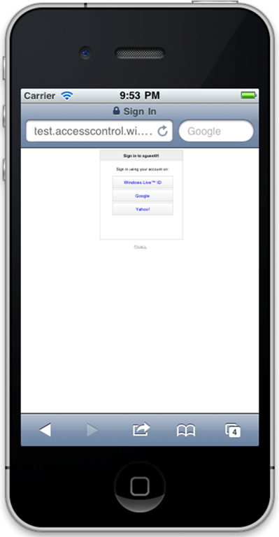
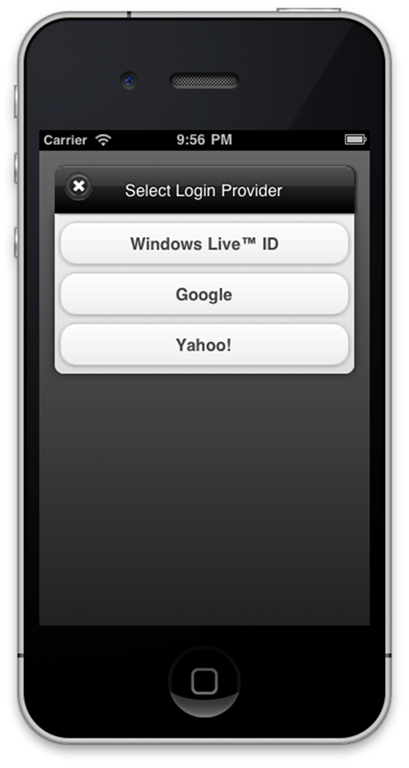

In my last post, I showed how to implement authentication using Google, Facebook, etc. for your iOS application – using the [Windows Azure Toolkit for iOS](http://github.com/microsoft-dpe).  This works well for iPhone applications written in Objective C, but what if you are developing a Web based mobile applications that span multiple platforms?  Given that everything is using Web pages, you would hope that it would be a little easier, but things can get tricky - especially if you are using jQueryMobile. 

<span class="more"></span>

Having implemented this a couple of times now, here is a rough guide of how to integrate AppFabric ACS (Access Control Service) authentication into a jQueryMobile application. (There is already a ton of documentation of both jQueryMobile and ACS, so I’m assuming that you understand the basics of how these both work).   

**Step 1:  Create your own provider selection screen**

When you first start playing around with using ACS on mobile web browsers, the first thing you'll notice is that the default login page isn't that nice. 



While the functionality of logging in will work, users have to pinch zoom to be able to read the buttons, which isn't a great experience.  It also doesn't fit in with any jQueryMobile theme that you may have created.  To overcome this, we can create our own provider screen. 



To build something similar to the above, I've used a jQueryMobile [Dialog](http://jquerymobile.com/test/docs/pages/dialog-alt.html) (which has an automatic border as well as a background effect).  The basic code for the screen looks like the following:
```html
<!DOCTYPE html>
<html>
<head>
    <title>Select Login Provider</title>
</head>
<body>
    <div data-role="dialog">
        <div data-role="header">
            <h1>Select Login Provider</h1>
        </div>
        <div data-role="content">
            @{
                if (ViewBag.JSONProviders != null)
                    {
                    var providers = Json.Decode(ViewBag.JSONProviders);
                    foreach (var provider in providers)
                    {
                        <button type="button" onclick="javascript:window.location.href='@provider.LoginUrl'">@provider.Name</button>
                    }
                }
            }
        </div>
    </div>
</body>
</html>
```

As you can see from the above, the form is built by parsing a JSON object containing a list of identity providers and creating buttons for each provider – setting a name for a button and setting an on click action to the URL.  (The above code uses the Razor-based syntax for  ASP.NET MVC, but the same will work just by using JSON calls in regular Javascript). 

Two things to note here:

1. It's really important to use **window.location.href** instead of an anchor when linking to the provider – otherwise you'll break the AJAX model of your jQueryMobile app and a new browser window will be launched (which looks horrible, especially in full screen web applications).

2. You are probably asking yourself where the JSON objects actually come from.  This brings us to our next point…

**Step 2:  Make a call to the ACS JSON endpoint**

The buttons in the form are based on identity providers, which you likely setup when you configured ACS.  These providers can be extracted as JSON objects using a JSON based endpoint that the ACS service providers. 

Here's the URL of the JSON endpoint for ACS v2.

```
https://{0}.accesscontrol.windows.net/v2/metadata/IdentityProviders.js?protocol=wsfederation&realm={1}&reply_to={2}&context=&request_id=&version=1.0](https://{0}.accesscontrol.windows.net/v2/metadata/IdentityProviders.js?protocol=wsfederation&realm={1}&reply_to={2}&context=&request_id=&version=1.0)
```

{0} is the namespace of your ACS service

{1} is the realm within your ACS service

{2} is an optional URL (which must be HTML encoded) that specifies where to return the browser once authentication has been completed.  Remember, if you are using AJAX navigation, then you'll want to pass in the correct #-prefixed syntax.  For example a return URL of the following:

```
http://localhost/MyWebApp#/MyWebApp/Accounts
```

Will instruct the ACS service to return to the Accounts page in your jQueryMobile app.

Again, you can make the call to the JSON endpoint using Javascript, or if you are using ASP.NET MVC like in Step 1 I would recommend creating a controller action called Providers which passes the return JSON object in a ViewBag. 

**Step 3:  Launch the providers screen from your app**

Finally, once you have your provider screen created, you'll need to call it when authentication is required.  There are a couple of different ways of doing this – if you are using Javascript only, then create and maintain a variable called claims – which corresponds to the claims bag returned from the service (when the ACS service returns it does a post back to your application so that you can capture the claims).  Secondly, if you are using ASP.NET MVC then you can create a second action on the Account controller called claims with something similar to the following:

```csharp
public JsonResult Claims()
{
    return Json(string.Join("n", ((IClaimsIdentity)this.User.Identity).Claims.Select(c => c.ClaimType + ": " + c.Value).ToArray()));
}
```

This will return the claims bag directly from the User.Identity property from the controller.

Well, just a short overview, but if you are thinking of implementing Google and Facebook authentication in your jQueryMobile application, hopefully this has been of some help.