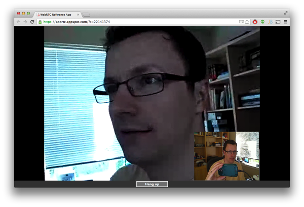

If you've been following any of the recent developments with WebRTC, you'll know that the majority of samples and example code available today target the Web browser (typically Chrome or Firefox).  While this is useful to get up to speed, IMO one of the most powerful applications of WebRTC will be for mobile devices.  Despite this, getting WebRTC running on mobile can be somewhat challenging.

<span class="more"></span>

**Update:  As a few readers have pointed out, the libjingle source has now been merged into the main WebRTC branch (https://code.google.com/p/webrtc/source/browse/trunk/talk). As a result, some of the instructions here will need to be adjusted.  I'm going to leave the post as is, but bear this in mind if you are following each of the steps.  Thanks.**

While Chrome Beta for Android supports WebRTC, any true mobile client will always need some kind of native application (in order to receive incoming calls in the background).  In this post, I'll be showing how to walk through the minefield of compiling WebRTC for Android in order to build your own demo app that you can expand upon.



**Configuring your Build Environment**

In order to build Android WebRTC, you are going to need a machine running Linux.  For the purposes of this article, I would recommend some kind of virtual image (VMWare or VirtualBox) running Ubuntu Server 12.04.2 LTS.  When you build your VM image, ensure that you use the 64bit version of Ubuntu, and that you allocate a minimum of 2Gb RAM to the image (any less and you may well see the compiler running out of memory).

After you get your Linux VM up, the first thing is to install the required build tools.  First, the git and subversion clients:

```
sudo apt-get install git git-svn subversion
```

Then, you'll need the Chromium depot tools - these tools are required to build the WebRTC bits, much of which derives from various parts of the Chromium project.  To install:

```
cd ~
git clone https://chromium.googlesource.com/chromium/tools/depot_tools.git
```

After the tools have been brought down, you'll also need to add them to your path:

```
echo export PATH="$PATH":`pwd`/depot_tools &gt;&gt; ~/.bashrc
```

Once this is done, log out and log back in to the server.  From the command line run:

```
gclient
```

If all is working, you should see a list of available client commands.  If you see "command not found", edit the ~/.bashrc file and double check your path is set correctly.

The final part of configuring your build environment involves installing some required libraries and compilers.  To perform this, use the following command:

```
sudo apt-get install g++ pkg-config gtk+-2.0 libnss3-dev
```

Once this is complete your machine should be in a position to start pulling down the WebRTC code.

**Obtaining libjingle Source Code**

In order to build the Android WebRTC client, we are going to pull down and compile the "libjingle" project.  Libjingle is a set of components to interoperate with Google Talk, but also contains (at the time of writing) the most complete and functional Android client.

To pull down the source, follow these instructions:

```
cd ~
mkdir libjingle
cd libjingle
gclient config http://libjingle.googlecode.com/svn/trunk
```

After you've run the config command you should notice a new file called .gclient in the ~/libjingle directory.  Edit this file (using VIM or nano) and append the following to the end of the file:

```
target_os=['android','unix']
```

This will instruct gclient to pull down the required third party libraries and other tools for an Android build of libjingle.

With this file modified, run the following command from the ~/libjingle directory:

```
gclient sync --nohooks
```

This will start a large sync of the liblibjingle source code, which will likely take some time.  A great opportunity for a coffee or break at this point!

**Installing the Oracle JDK**

Before we can compile libjingle, we'll need to install the Oracle JDK.  Although the majority of the library is native (and uses the Android NDK) this is required to build the JAR and APK file at the end of the build.

To install, go to the Oracle JDK downloads page ([http://www.oracle.com/technetwork/java/javase/downloads/index.html](http://www.oracle.com/technetwork/java/javase/downloads/index.html)) and download the latest JDK 1.6\.  Note that JDK 7 will not work and you will get errors later on.  For the purpose of this tutorial I have been using Java SE Development Kit 6u45.

As you are running server, you may need to download the JDK on another machine (where you will need to accept the license agreement) and then copy the .bin file to your Linux server (using either curl, wget, or VMWare shared folders).

Assuming the .bin file is in your home (~) directory, to install the JDK, perform the following:

```
cd /usr/lib/jvm && sudo /bin/sh ~/jdk-6u45-linux-x64.bin -noregister
```

This will extract the JDK to the /usr/lib/jvm directory.  After this is complete, we need to set the defaults to use the Oracle VM as opposed to the OpenJDK VM (which is installed by default).

```
sudo update-alternatives --install /usr/bin/javac javac /usr/lib/jvm/jdk1.6.0_45/bin/javac 50000
sudo update-alternatives --install /usr/bin/java java /usr/lib/jvm/jdk1.6.0_45/bin/java 50000
sudo update-alternatives --config javac
sudo update-alternatives --config java
```

Finally, to overcome a small bug in the libjingle gwp compile scripts, we need to create a symbolic link:

```
cd /usr/lib
ln -s jdk1.6.0_45 java-6-sun
```

After you've done this, run the following command:

```
java -version
```

If you see "Java HotSpot build 1.6.0_45" instead of "OpenJDK", the correct version of Java is install and you should be in good shape.

**Preparing for Compilation**

Before we compile, there are a few things that are required.  Firstly, we need to install some 32 bit compatibility libraries so that aapt and other Android compilation tools will function correctly.  To install, run the following command:

```
sudo apt-get install ia32-libs
```

Next, edit ~/libjingle/trunk/third_party/webrtc/build/common.gypi

Navigate to the line that contains:

```
enable_tracing==0
```

and replace with:

```
enable_tracing==1
```

This will prevent the Android client from crashing (when it realizes it doesn't have a default trace file) and will make debugging the Android application a whole lot easier!

Finally, perform the following commands to complete preparation:

```
cd ~/libjingle/trunk
./build/install-build-deps-android.sh
. ./build/android/envsetup.sh
```

This will correctly setup the android dependencies.  Note the leading period on the envsetup script - this is very important as we need the variables to be set for the rest of the session.

Assuming these commands ran without errors, now run:

```
gclient runhooks
```

This command will generate the required ninja gwp compilation scripts.  After this, run:

```
android_gyp
```

You may get an error indicating that content.gyp could not be found - it is fine to ignore this for now.

**Compiling!**

If you've reached this stage, congratulations!  We can now try to compile!  To do this, run the following command from the ~/libjingle/trunk directory:

```
ninja -C out/Debug -j 10 AppRTCDemo
```

This command is instructing the ninja compile tool to generate a debug version of the build, using a maximum of 10 concurrent build threads.

Depending on your machine, compilation will likely take about 10-15 minutes (time for that other coffee!).  Assuming everything went well, you should see some output in the ~/libjingle/trunk/out/Debug folder:

```
AppRTCDemo-debug.apk
```

This is the main demo APK.

```
libjingle_peerconnection.jar
```

This is the JAR for libjingle.

```
libjingle_peerconnection_so.so
```

This is the ARM-based native library.

**Running the APK on your device**

To run the APK on your device, copy the file to a machine with ADB installed (and your device connected) and run the following command:

```
adb -d install AppRTCDemo-debug.apk
```

If all goes well, you should see a new application called "AppRTC".  To test the application, launch a new browser on your desktop (not on the phone!) and navigate to http://apprtc.appspot.com.  Enable access to your camera and microphone and note the room number of the conference window.

Now, launch the AppRTC application on your device and enter the room number as part of the URL (ensure that there are no spaces).  If all goes well you should have an established connection with video and audio between the browser and the mobile device!

If you run into issues (and this is quite complex, so it's usual) check ADB logcat for any errors and exceptions that are being produced by the AppRTC application.  Although functionally, this code is working, at the time of writing the TURN server being hosted on Google's Compute Cloud is having some issues - so I had to dive into the code and configure the application to use an alternative - but that's probably a good excuse for another post sometime in the future!

Either way, I hope this was useful and good luck!
