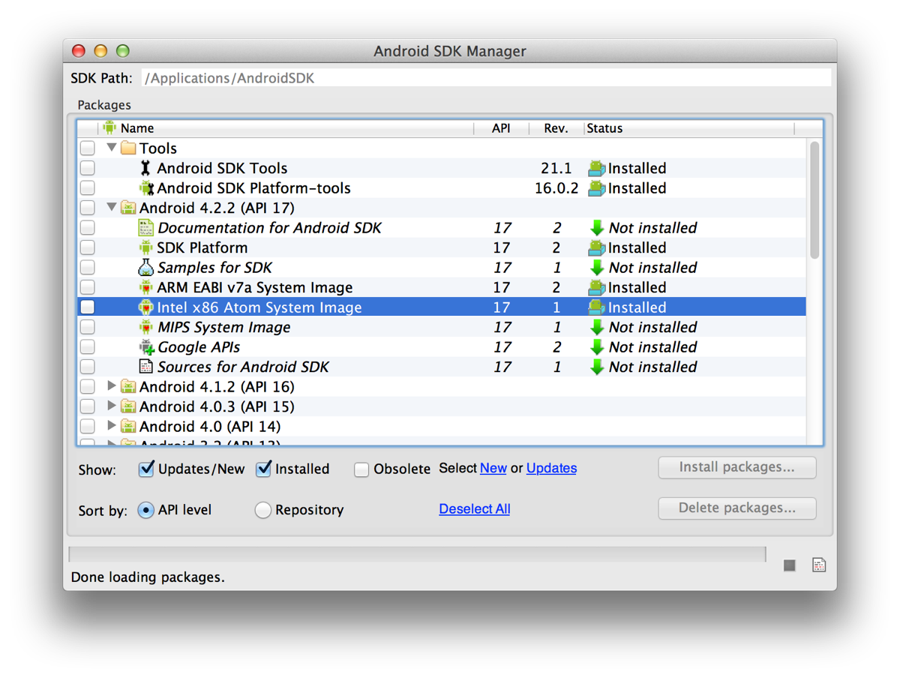
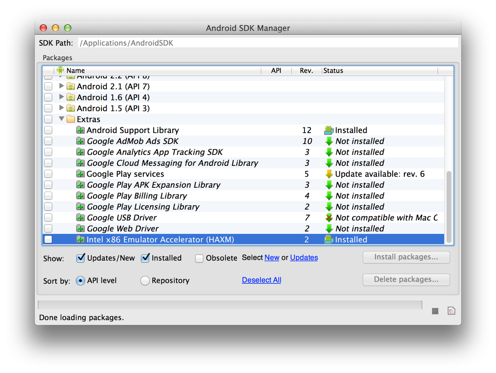
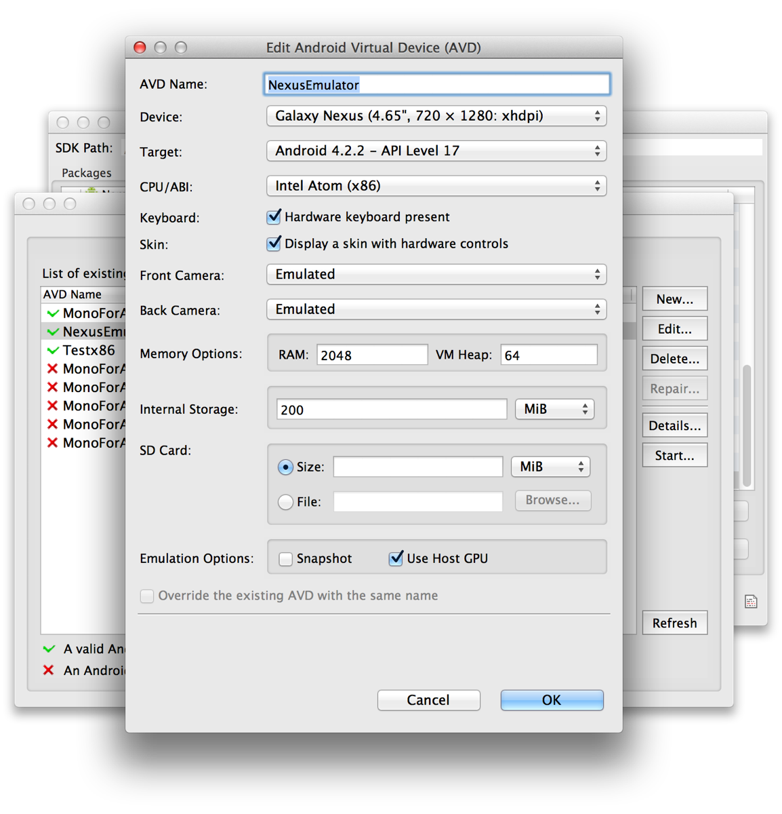
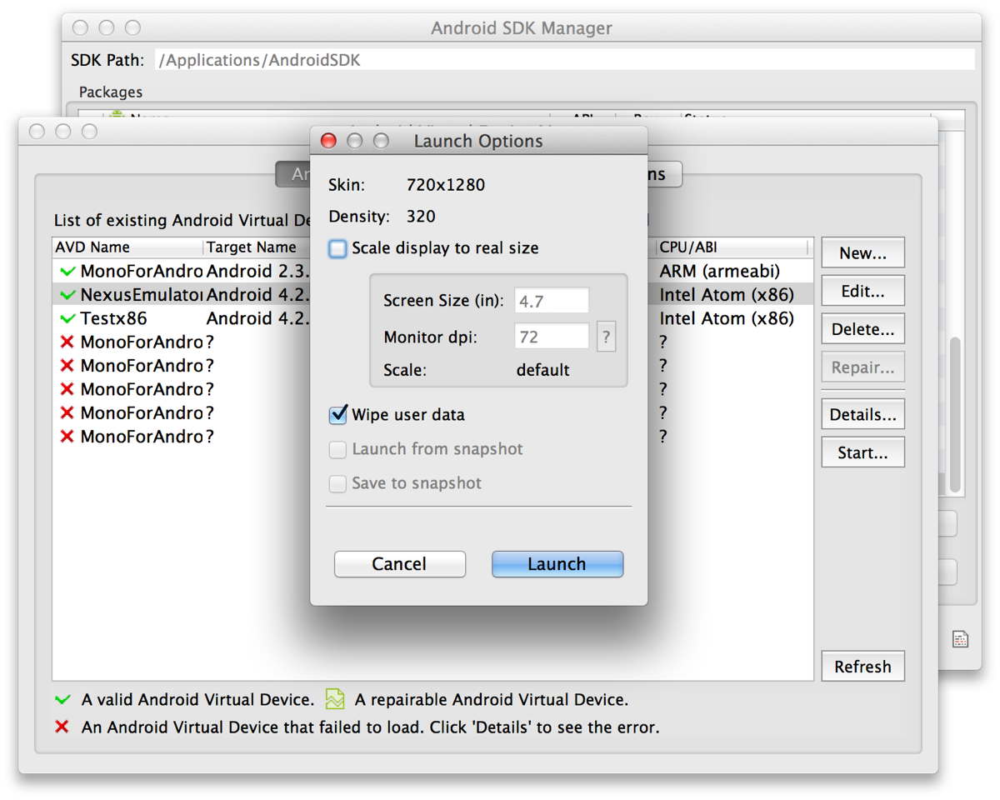

If you've undertaken any Android development, you'll have likely found that the Android emulator can be painfully slow – to the point where the majority of developers I know use a physical device to do any development at all.  The primary reason behind this is that the default emulator is emulating an ARM based chipset on x86 hardware, and the translation between these two architectures is of course costly.  What many of these developers may not realize (and I didn't until very recently) is that Intel have released a x86 Android emulator.  The x86 emulator has a few caveats (and of course cannot run any ARM-only libraries, such as the Google Play APIs), but overall can be used to speed up the performance of testing apps in the emulator by leaps and bounds.

This is how to get it working:

1. In the Android SDK Manager, ensure you have API Level 15 or higher installed.  Under the API of your choice, install the Intel x86 Atom System Image:

2. Under the Extras folder, install the Intel x86 Emulator Accelerator (HAXM) module:

3. After you add the HAXM support through the SDK manager, you still need to install the HAXM package.  To do this, navigate to the Extras/Intel/Hardware_Accelerated_Execution_Manager folder under your installed Android SDK path.  Run the .dmg in this folder to install the support.  As part of the installation, you'll be asked how much RAM to allocate/partition.  On my 16Gb MBP, I have chosen a 2Gb allocation.

4. This is **really important** (for Mac OS X Mountain Lion users).  Go to [this knowledge library page](http://software.intel.com/en-us/articles/intel-hardware-accelerated-execution-manager) on Intel's HAXM site and install the 1.0.4 hotfix.  If you do not install this hotfix, you will likely get a kernel panic when you try to start the AVD.

5. Create a new AVD, or edit an existing AVD.  Ensure that the CPU/ABI is set to Intel Atom (x86).

You can also increase the RAM up to the limit that you set during the HAXM installation.  Also, you should ensure that the "Use Host GPU" check box is enabled as this will allow the emulator to use OpenGL ES on the host for increased performance.
 
With that you should be set!  If you are editing an existing AVD, I recommend checking the "Wipe user data" checkbox before starting the image.  (Otherwise you might find that the emulator will hang during start up).  
 

If everything is working OK, you should receive a message that HAXM has been enabled, and your AVD should boot in several seconds (as opposed to several minutes) and be lightning quick to use!
