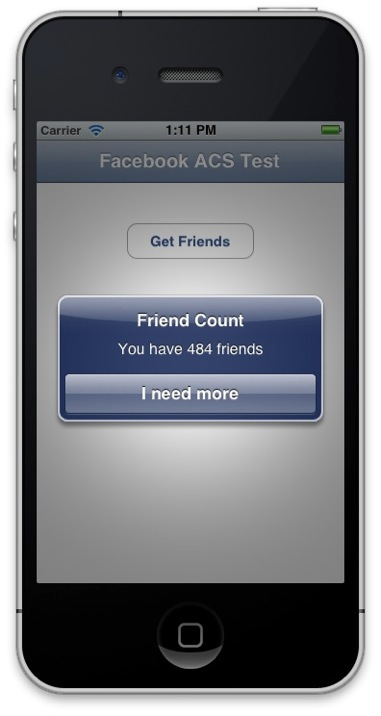

A couple of my previous blog posts have shown how AppFabric ACS (Access Control Service) can be used as part of the Windows Azure Toolkit for iOS to enable federated authentication with Facebook, Google, Yahoo, and other providers. I was recently asked whether it’s possible to extract an OAuth token as part of the ACS sign in process that can then be presented to Facebook’s Graph API in order to access details such as friends lists, photos, etc. In this post, I'll cover how this can be done.

<span class="more"></span>

The first step is of course to display the authentication page. As you've seen in previous posts, this can be achieved using the following:
```objectivec
WACloudAccessControlClient *acsClient = [WACloudAccessControlClient accessControlClientForNamespace:@“iostest-walkthrough” realm:@“uri:wazmobiletoolkit”];
[acsClient showInViewController:self allowsClose:NO withCompletionHandler:^(BOOL authenticated) { if (!authenticated) { NSLog(@"Error authenticating"); } else { WACloudAccessToken *token = [WACloudAccessControlClient sharedToken]; NSString *securityToken = [token securityToken]; ... }
}];
```
In the application, this will display the federated login dialog, and prompt the user to enter their Facebook credentials.


You'll notice that the ACS client returns a cloud access token, of which a security token can be extracted. This security token is a set of claims returned from ACS. Here’s an example:

```
http://schemas.microsoft.com/ws/2008/06/identity/claims/expiration=2011-11-11T22:00:00.3593475Z&amp;http://schemas.xmlsoap.org/ws/2005/05/identity/claims/emailaddress=me%40simonguest.com&amp;http://schemas.xmlsoap.org/ws/2005/05/identity/claims/name=Simon+Guest&amp;http://schemas.xmlsoap.org/ws/2005/05/identity/claims/nameidentifier=677830765&amp;http://www.facebook.com/claims/AccessToken=AAADWLwgHWSUBABBXdxbhJB0ZBtA3VOfPSsqzKKwObAtW2rb8EGGTQ8EvnvAdNOcZAGpKfV2gSGbNg7f0gxk4BhI1rhzKEn17VLw343gZDZD&amp;http://schemas.microsoft.com/accesscontrolservice/2010/07/claims/identityprovider=Facebook-235497486506277&amp;Audience=uri:wazmobiletoolkit&amp;ExpiresOn=1321044986&amp;Issuer=https://iostest-walkthrough.accesscontrol.windows.net/&amp;HMACSHA256=bnvyPmX4/PcWhiImgVVIvSqwHpc4cfi0vI6%2b/BSDK0Q%3d
```
If we want to make follow on calls to Facebook’s Graph API, we are going to need to present the Facebook User ID and an OAuth Token. Fortunately both of these can be extracted from the token.

To extract this, we first HTTP encode the token:
```objectivec
NSMutableArray *httpEncoding = [NSMutableArray arrayWithObjects:[NSArray arrayWithObjects:@"%3a",@":",nil], [NSArray arrayWithObjects:@"%2f",@"/",nil], nil];
while ([httpEncoding count] &gt;= 1) { securityToken = [securityToken stringByReplacingOccurrencesOfString:[[httpEncoding objectAtIndex:0] objectAtIndex:0] withString:[[httpEncoding objectAtIndex:0] objectAtIndex:1]]; [httpEncoding removeObjectAtIndex:0]; }
NSError *error = NULL;
```
Using a simple RegEx search we can extract the Facebook User ID:

```objectivec
NSRegularExpression regex = [NSRegularExpression regularExpressionWithPattern:@“http://schemas.xmlsoap.org/ws/2005/05/identity/claims/nameidentifier=([0-9])” options:0 error:&amp;error];
NSTextCheckingResult *match = [regex firstMatchInString:securityToken options:0 range:NSMakeRange(0, [securityToken length])]; firstRange = [match rangeAtIndex:1]; fbuserId = [securityToken substringWithRange:firstRange];
```
And the required OAuthToken:
```objectivec
regex = [NSRegularExpression regularExpressionWithPattern:@“http://www.facebook.com/claims/AccessToken=([A-Za-z0-9]*)” options:0 error:&amp;error];
match = [regex firstMatchInString:securityToken options:0 range:NSMakeRange(0, [securityToken length])];
NSRange firstRange = [match rangeAtIndex:1];
oauthToken = [securityToken substringWithRange:firstRange];
```
Now it’s just a case of calling the Graph API using these credentials:
```objectivec
NSString *graphURL = [NSString stringWithFormat:@“https://graph.facebook.com/%@/friends?access_token=%@”,fbuserId,oauthToken];
```
For the purposes of this post, let’s take a quick look at my list of friends.
```objectivec
NSURLRequest *request = [NSURLRequest requestWithURL:[NSURL URLWithString:graphURL]];
NSURLResponse *response = NULL;
NSData *data = [NSURLConnection sendSynchronousRequest:request returningResponse:&amp;response error:&amp;error];
NSString *friendsList = [[NSString alloc] initWithData:data encoding:NSUTF8StringEncoding];
regex = [NSRegularExpression regularExpressionWithPattern:@“id” options:0 error:&amp;error];
NSUInteger friendCount = [regex numberOfMatchesInString:friendsList options:0 range:NSMakeRange(0, [friendsList length])];
```
Displaying the friend count in a UIAlertView on the screen shows how popular (or not!) I am:



A simple example, but hopefully this shows not only that you can authenticate against Facebook using AppFabric ACS, but also how the returned Facebook User ID and OAuth Token can be used to make further calls to Facebook using the user’s credentials.
