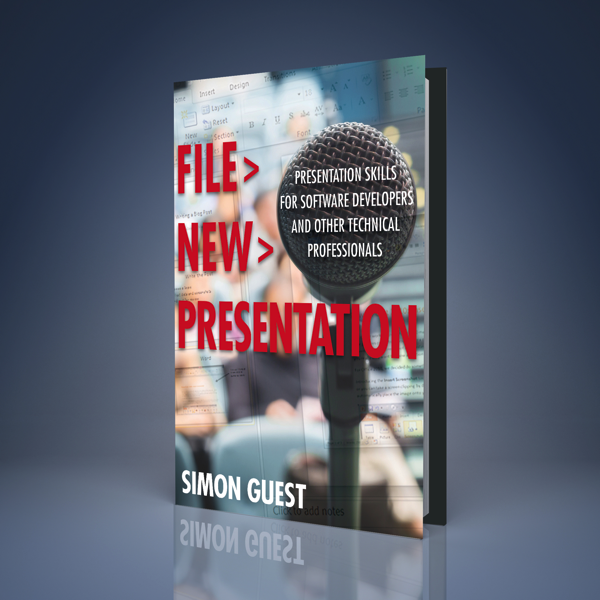

About a year ago, I set out on a journey to write a book on presentation skills, aimed primarily towards software developers and other technical professionals. My reasoning is that too many presentations in our industry still fail to connect with their audience, don’t tell a story, and end up as a set of mind-numbing slides of bullet points that put people to sleep.

The book, aptly titled 'File > New > Presentation', was released last November, and reviews have started to appear in the New Year - a few on [Amazon](http://www.amazon.com/File-New-Presentation-Developers-Professionals-ebook/dp/B00GEH9FHM), and [this one](http://www.joshholmes.com/blog/2014/01/26/file-new-presentation-a-review/) by Josh Holmes, who presented about the subject at CodeMash earlier this month.

If you are a developer (or other technical professional), looking to improve your presentation skills, I hope you’ll check out the book. You can find it on [Amazon](http://www.amazon.com/File-New-Presentation-Developers-Professionals-ebook/dp/B00GEH9FHM) in both Kindle and paperback format.
