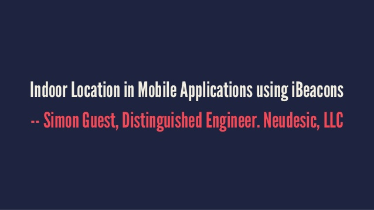

A couple of weeks ago, I had the privilege of speaking at [GIDS](http://www.developermarch.com/developersummit/about.html) (the Great Indian Developer Summit) 2014 in Bangalore. GIDS is a multi-day event, with each day dedicated to a particular theme or topic. I spoke on the Wednesday (the Web/Mobile day) and had three sessions covering mobile app development using iBeacons, tips and tricks using AngularJS, and automated Web testing using JavaScript.

Thanks to everyone who came to each of the sessions. I really enjoyed the feedback and audience participation, and look forward to similar sessions in the future. I've included links to the three decks below on Slideshare, and have posted all of the source code [here](http://github.com/simonguest/gids).

