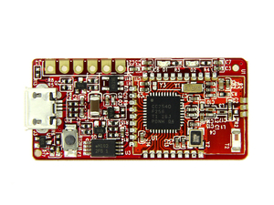
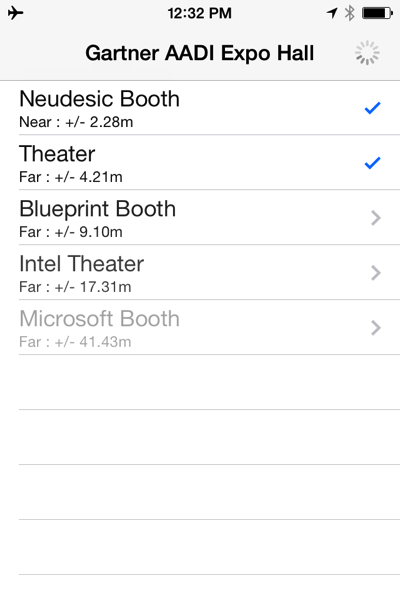
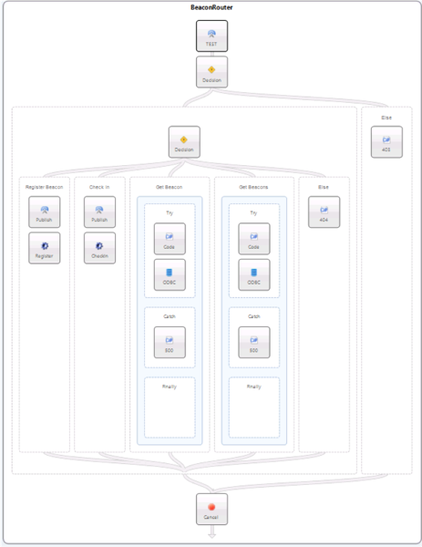

Last week, I joined my colleagues from Neudesic at the Gartner AADI (Application Architecture Development &amp; Integration) Summit in Las Vegas. One of the neat things that we were showing was a demo of iBeacon technology, in order to help locate and pinpoint individuals within indoor environments where GPS is not an option. 

To achieve this, we placed a selection of iBeacons around the expo floor (for the iBeacons we used RedBear’s BLE Mini boards, flashed with their iBeacon firmware).

Using Bluetooth LE (a.k.a. Bluetooth Smart), each beacon transmits a unique ID (made up of a major and minor value) on a particular “frequency" (known as a proximity UUID). iBeacon supported mobile applications are then able to “tune in” to this proximity UUID, and based on the power signal for each beacon, determine which area of the floor a user is located closest to.

Using this information we created a mobile app that reports on all of the beacons within range on the expo floor. As you can see in the above screenshot, we have 5 iBeacons in range, listed in order of proximity, with an estimated distance calculated by the power signal. As you can likely gather from the data, we were located in the Neudesic booth at the time this screenshot was taken, with the theater, and a selection of other booths in range.

For the show, we developed two versions of the application - one for iOS and one for Android. Both are native mobile applications written using [Xamarin](http://xamarin.com), using CLLocationManager for iOS, and Radius Network’s [binding](https://github.com/RadiusNetworks/android-ibeacon-service) for supporting iBeacon on Android. The Radius implementation is especially interesting in that the beacon detection runs as a background service, polling for new iBeacons and raising intents to the UI as necessary (even though Bluetooth LE is a lot more responsible with power vs. regular Bluetooth, we still need to be careful not to kill the battery when using this however).

While this is neat to show just as a mobile application, we wanted to take it one step further and demonstrate how this could be applied in the real world with [Neuron](http://www.neuronesb.com), an ESB product from Neudesic. For our expo demo, Neuron provided a backbone infrastructure to allow the mobile app to resolve a name for a beacon ID (think of his like DNS for iBeacons!) and also give a scalable way for users to “check in” to an iBeacon the same way that they would check in via Foursquare or Facebook.

As shown above, we developed a process flow using Neuron to accept incoming messages from the mobile application, and then provided logic to determine whether the device was trying to acquire a name for a beacon, or whether the user had walked in to the area of a beacon and wanted to “check in”. The benefit for using Neuron in this situation vs. just propping up a single web service is that our application can now scale to hundreds of thousands of concurrent mobile clients without needing to make any major adjustments on the server-side.

If you were able to stop by the booth at the Gartner summit, I hope you enjoyed the demo and the conversation. If you weren’t able to attend, but would like to know more about how Neudesic is working with various organizations on iBeacon technology and/or Neuron, feel free to drop me a line.
