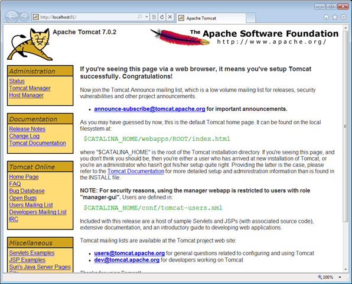

As I mentioned in my previous post, I’ll be participating in a [panel](http://www.eventreg.com/cc250/sessionDetail.jsp?SID=313962) at JavaOne on Monday.  With a similar format to last year, each panelist is given 5 – 10 minutes before it opens up for general discussion. Rather than showing a bunch of marketing slides, I thought it would be more interesting to put together a short tutorial for running Apache Tomcat on Windows Azure.  When I speak with Java developers interested in Windows Azure, this is often the #1 request. Here is an overview of what I will be showing:

**Step 1 – What you’ll need to get started**

As you might imagine, you are going to first need a Windows Azure account.  I would recommend going to [www.microsoft.com/windowsazure/offers](http://www.microsoft.com/windowsazure/offers) and signing up for the introductory special, which will allow you to test your application for free.  The introductory offer gives you the first 25 hours at no cost, which should be more than enough time to get up and running.

If you are at JavaOne however, I have a limited quantity (100) of tokens that give you 30 days worth of access with no need to submit any registration or credit card information.  See me at the end of the panel session or throughout the conference, and in exchange for a business card, I’ll be happy to give you one at no cost!

After you have your account, you’ll want to download and install the [Windows Azure SDK](http://go.microsoft.com/fwlink/?LinkID=130232).  After installation, set your PATH environment to include the location of the SDK binaries (typically _C:/Program Files/Windows Azure SDK/v1.1/bin_).  This is important to ensure that the SDK is accessible from the command line.

Finally, you’ll need to install the [Windows Azure Tomcat Solution Accelerator](http://code.msdn.microsoft.com/winazuretomcat).  Feel free to install this in any directory you’d like – I’m using _c:/dev/javaone2010/tomcat/azure_ for the purposes of this tutorial.

**Step 2 – Building and running your site**

With all of the pre-requisites downloaded and installed, it’s time to build and test your site.  To do this, open a command prompt, and navigate to the directory that you chose for the solution accelerator.  From this directory, run **buildme.cmd**.  You’ll be prompted to provide the installation path of your Tomcat installation and a JRE on your machine.

After a successful build, run the **runme.cmd** file. This will run Tomcat using the Windows Azure Desktop Execution Tool – also known as the local development fabric.

This is a great way to test that your application is going to work when deployed to production.  Navigate to the URL provided at the end (replace the tcp with http) to ensure that the Tomcat instance is working correctly on your local machine.

You can open the development fabric tool (found running in your system tray) if you want to stop and/or investigate the service.

**Step 3 – Packaging and deploying your site**

Once you are satisfied that everything looks good, it’s time to package the application ready for deployment to the cloud.  To do this, run the **packme.cmd **script.  This will invoke the Windows Azure Packaging Tool, and pull together everything needed into one package file for deployment.

When this has completed, you should see a **Tomcat.cspkg **file and a **ServiceConfiguration.cscfg **file in the directory.  The .cspkg file is quite large as it contains your application, the Tomcat instance, and JRE binaries.  Despite the size, this format makes it convenient if you prefer to use a different version of Tomcat or a different JRE in the future.

To deploy to the cloud, log on to the portal ([http://windows.azure.com](http://windows.azure.com)) and create a new hosted service.  Walk through the wizard to specify the name, description, URL, and location where you want the service to be deployed.  Next, hit the “Deploy” button and specify the location of the previous package and configuration file.

You have two options when it comes to deploying – either a file from your local storage (i.e. your local disk) or a file from an Azure storage account (blob storage).  If you have issues with the local storage (many http connections timeout before the package can be uploaded in time), I would recommend using [Neudesic’s Azure Storage Explorer](http://azurestorageexplorer.codeplex.com/) to upload your files to a blob storage container.

Hit _Deploy_, and your package will be uploaded to Windows Azure – this will likely take a few minutes because of the size of the deployment.

Once this has been completed, hit the _Run_ button to bring your site to life.

Once you have a site up and running, feel free to explore some of the ways that you can either scale your application to multiple nodes or explore some of the [other features](http://www.windowsazure4j.org) on Windows Azure available to Java developers.

There are many ways that this could be improved by integrating with existing build environments (I think Maven integration would be fascinating), but hopefully this short tutorial gives you a starting point for getting a simple Tomcat site up and running on Windows Azure.
