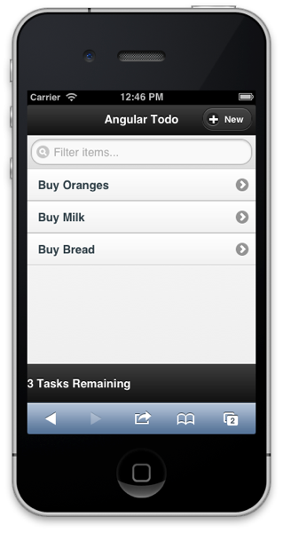
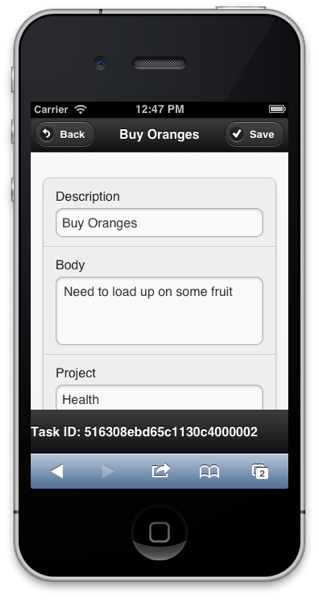

Both jQuery Mobile (jQM) and AngularJS are awesome at what they do, but getting them to play nicely together can be tricky.  As you may have discovered, both want to manipulate the URL/routes and DOM such that it's very easily to get them in conflict.  Having been through this recently, I wanted to share some recommendations to get them working together.

<span class="more"></span>

**Load jQM libs before AngularJS**

Because both frameworks heavily manipulate the DOM, it's important to get the load order right.  I found that loading AngularJS first led to some interesting (and annoying!) UI functionality.  The correct order should be jQuery first, followed by jQM, and then AngularJS:
```html
<script src="http://code.jquery.com/jquery-1.8.2.min.js"></script>
<script src="http://code.jquery.com/mobile/1.3.0/jquery.mobile-1.3.0.min.js"></script>
<script src="https://ajax.googleapis.com/ajax/libs/angularjs/1.0.6/angular.min.js"></script>
<script src="https://ajax.googleapis.com/ajax/libs/angularjs/1.0.6/angular-resource.min.js"></script>
```
**Let jQM handle the URL routing**

I'm likely to get flamed for this by MV* purists, but I recommend letting jQM handle all of the URL routing - and not using AngularJS for any routing.  Firstly, I spent a lot of time trying it the other way (disabling routing for jQM, and configuring various routes, templates, partial files, etc.).  Even when it did work, it was just a mess - it looked like someone had taken a shotgun to my jQM app and blown it into several pieces.  Secondly, I would argue that URL routing really shouldn't be a primary consideration for a mobile Web app.  The app is more likely launched by an icon on the home screen vs. a search or link with any type of query string.  Even if it does, a simple check for a null scope is all that's required.

**Create a single Angular controller for a group of jQM pages**

Conforming to #2 means that you can create a single controller that spans a number of individual jQM pages.  This usage results in very elegant single HTML page together with a single controller - yet has the advantage of offering multiple pages to the user.

To demonstrate this in more detail, and because you can't have enough Todo list apps, I've put together a [sample](http://github.com/simonguest/jqm-angular-sample) using jQM, AngularJS, speaking to a service using Node, Mongoose, and MongoDB.  (To run, you'll need a local Mongo DB called "todo" with a collection called "tasks").  It definitely shows the power of both frameworks running together.  In just 75 lines of HTML and 29 lines of JavaScript for the controller, I have a mobile app with full CRUD support.  Hope you find it useful.



