When I speak with customers about cloud computing, a common question is often “how do I migrate an application to the cloud?"  While this is a multi-part answer, one of the hurdles for migration is often storage. 

Many applications store data using the file system (e.g. read / write a file to d:dataconfig.xml).  Moving these types of applications to the cloud can be difficult as the storage mechanisms in the cloud are somewhat different. 

<span class="more"></span>

To help address this problem, in Feb 2010 we released v1.1 of the [Windows Azure SDK](http://www.microsoft.com/downloads/details.aspx?FamilyID=5664019e-6860-4c33-9843-4eb40b297ab6&DisplayLang=en) which supports a new feature call Cloud Drives.  A Cloud Drive is the ability to mount a virtual drive in the cloud so that applications can write to it as they would a local drive.  This cloud drive is persisted so that even if the machine goes down, the data is not lost.

What many people don’t realize however is that the format that the Cloud Drive uses is interchangeable with the VHD (Virtual Hard Drive) format used by virtualization products such as Hyper-V, Virtual PC, Windows Server, and Windows 7.  What this means is that you can create a single VHD, use it locally on a Windows PC, attach it to a virtualized image, and now copy it to the cloud and access it there also.  As you can imagine, for anyone looking to migrate applications to the cloud, this opens up a world of possibilities.

In this post, I’ll walk through a series of steps that show creating a VHD from scratch, copying it to the cloud, and accessing it from a web role running in Azure.

**Before you begin**

You’ll of course need an Azure account.  If you don’t have one, you can go [here](http://www.microsoft.com/windowsazure/account/) to sign up.

Once you have your account, you’ll need to setup two new services. 

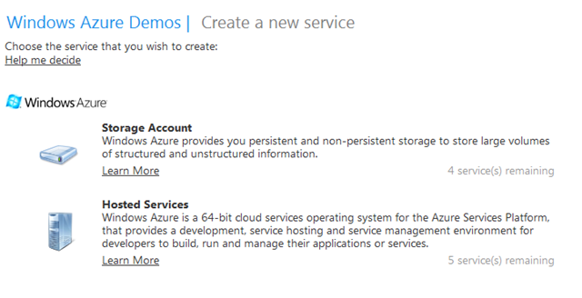 

You’ll need to create a storage account – this is where the VHDs will be stored – and a hosted service to run your application from.  When you set them up, make sure that they are created in the same geography (i.e. don’t have your storage account in Asia, and your hosted service in the US as the drive mounting has to be in the same region).

Once you have your storage account and service created, you are ready to create and upload your VHD. 

**Step 1.  You’ll need a VHD**

If you already have a VHD file that you would like to use, you can skip to Step 2.  You’ll be copying this VHD to the cloud, so you may want to choose a smaller VHD file for test purposes.

If you are running Windows 7, creating a new VHD is easy. 

Firstly, go to the start menu and type **disk management**. 

From the start menu click on **Create and format hard disk partitions**

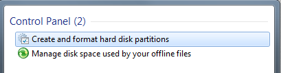

This will open up the disk management tool.  From the **Action** menu, select **Create VHD**.

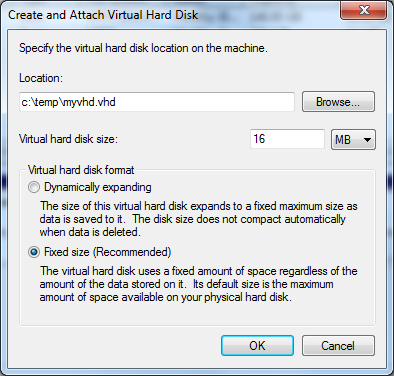

Enter a location for the VHD file and a size.  The minimum is 16Mb and the maximum is likely the amount of free disk space on your machine. 

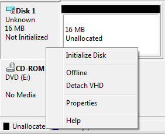 

When your disk appears in the management tool, right click on the disk name and select **Initialize Disk**.  Select the default (MBR) and select OK.

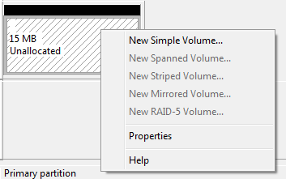

After initialization, right click on the disk and create a **New Simple Volume**.  Walk through the wizard, accepting the defaults and assign a drive letter to the VHD.  Finally, format the disk using NTFS (a quick format is fine).  If a dialog box appears asking you to format the disk (sometimes the disk gets detected just before formatting has begun), just hit cancel.

After this is done, you can open the drive and access it as you would any other drive. Add some files and folders, etc.

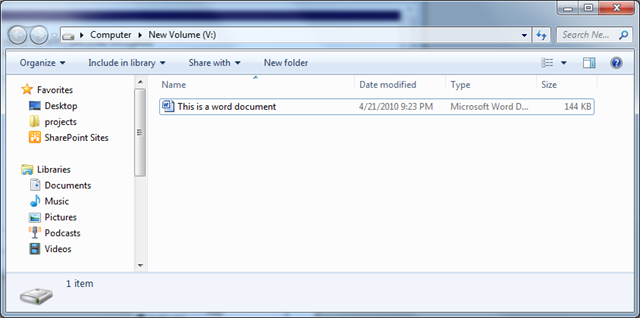 

When you are ready to upload to the cloud, you’ll need to detach the drive.  To do this, go back in to the disk management tool, right click on the disk name and select **Detach VHD**.

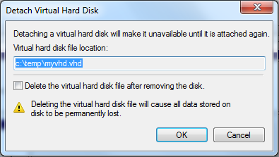

(Do not select the Delete the virtual hard disk file checkbox – otherwise, they’ll be nothing to upload!)

**Step 2.  Upload it to Azure Storage**

The next step is to upload the VHD to the cloud.  The VHD will be stored in something called Blob (Binary Large OBject) storage.  You may have heard of blob storage if you’ve seen any of the introductory Azure presentations.  It’s the type of storage that is used for binary data such as images, videos, and the like.

In February we enabled support for Page Blobs.  Page Blobs are binary objects stored in the cloud that support random read/writes through pages.  This makes them ideal for dealing with VHD type of access, and this is the format that we’ll be using to upload our VHD to the cloud.

The one caveat of this is that you must use a tool that supports page blobs (most of the tools available today only support regular blobs).  The tool I would recommend is [Cloud Storage Studio](http://www.cerebrata.com/Products/CloudStorageStudio/Default.aspx) by Cerebrata as it supports page blobs through a nice interface.

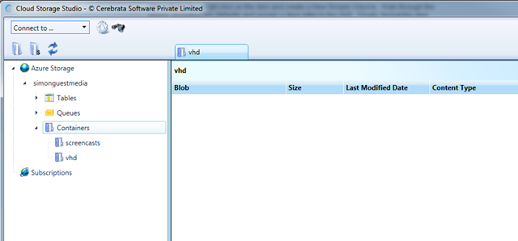

Open the tool and access the storage account that you created in the “Before you begin” section earlier in this post. 

I would recommend creating a new container for your VHD images to keep them separate from other content.  As shown in the screenshot above, I’ve created a container called vhd.

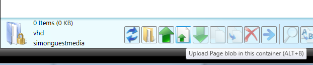

Select the container, and click on the **Upload Page Blob** button.  There are two upload buttons – you need the one with the icon that includes the page and the up arrow.

Point to the location of your VHD file and click on the **Upload** button.

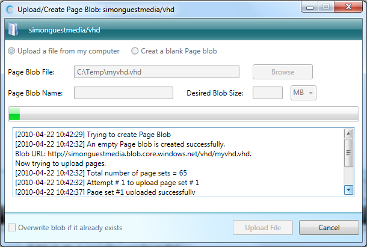

This might take a little way depending on the size of your VHD and the speed of your network.

Once you have uploaded the file, validate that it exists by hitting the refresh button.

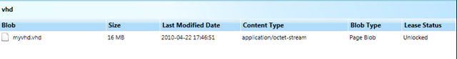

With the VHD uploaded, we can now move on to creating the cloud application that accesses it.

**Step 3.  Accessing the VHD from Windows Azure **

I’m going to assume that you have some knowledge of creating an ASP.NET application and uploading it to Windows Azure.  If you haven’t done this before, I would recommend checking out the [Windows Azure Training Kit](http://www.microsoft.com/downloads/details.aspx?FamilyID=413E88F8-5966-4A83-B309-53B7B77EDF78&displaylang=en).

To access the VHD in the cloud, we create a webrole and use the following code.

Add reference to the **Microsoft.WindowsAzure.CloudDrive.DLL** that can be found in the GAC (assuming that you have the [v1.1 SDK](http://www.microsoft.com/downloads/details.aspx?FamilyID=dba6a576-468d-4ef6-877e-b14e3c865d3a&displaylang=en) installed).  Then, in your webrole, you’ll need to add the following using statements:

```cs
using Microsoft.WindowsAzure;
using Microsoft.WindowsAzure.ServiceRuntime;
using Microsoft.WindowsAzure.StorageClient;
```

Here is the code that you should run in your web role.  (You can place this behind a button or something…)

```cs
String accountName = "";  // insert your storage account name here
String accountKey = "”;  // insert your storage account primary key here
StorageCredentialsAccountAndKey credentials = new StorageCredentialsAccountAndKey(accountName, accountKey);

CloudStorageAccount storageAccount = new CloudStorageAccount(credentials, new Uri(String.Format("http://{0}.blob.core.windows.net",accountName)),new Uri(String.Format("http://{0}.queue.core.windows.net", accountName)),new Uri(String.Format("http://{0}.table.core.windows.net", accountName)));

// initialize the local cache - need to trim the end backslash otherwise, HRESULT=D0000033
LocalResource localCache = RoleEnvironment.GetLocalResource("LocalCache");
CloudDrive.InitializeCache(localCache.RootPath.TrimEnd(''), localCache.MaximumSizeInMegabytes);

// Create and mount the drive
CloudDrive c = storageAccount.CreateCloudDrive("vhd/myvhd.vhd");
String driveLetter = c.Mount(localCache.MaximumSizeInMegabytes, DriveMountOptions.None);

// do regular System.IO.File and System.IO.Directory operations here against driveLetter
Response.Write(System.IO.Directory.GetFiles(driveLetter + "").Count() + " files found on the root of the mounted drive.");

// unmount the drive
c.Unmount();
```

There are five main pieces to the code.

Firstly, the storage account reference is created using the account name and key that you retrieve when you setup your Azure account.

After that we need to initialize a local cache used by the cloud drive.  To create this, insert the following code into your ServiceDefinition.csdef file on your webrole.

```xml
<LocalResources>
  <LocalStorage name="LocalCache" cleanOnRoleRecycle="false" sizeInMB="100" />
</LocalResources>
```
We then create and mount the drive using the **CreateCloudDrive** and **Mount** methods.  Make sure that the path and name to your VHD matches what you uploaded in Step 2.

Once the drive is mounted we get a drive letter (as a string – e.g. “f:”).  You can then make calls to that drive letter using the regular calls (e.g. **System.IO.File** and **System.IO.Directory**).  In a worker role you can even launch applications from the VHD by spawning a new process. 

Finally, to unmount the drive, just call the **Unmount** method to release the VHD image.

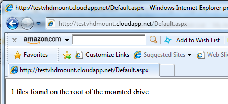 

There are a lot of details behind the scenes that I’m not going to go into here (e.g. read and read/write access to the VHD)  - if you want to learn more, I would recommend checking out [this PDC session](http://microsoftpdc.com/Sessions/SVC14) by Brad Calder

**Appendix.  Running this in a local development environment.**

You should note that uploading a VHD only works using a live deployment in the cloud.  In the local development fabric, you’ll find that you cannot access a remote VHD (you’ll get a HRESULT = 80070003 error).  Also, you can’t upload a page blob to local development storage.

However, you can still duplicate the same functionality in the local development environment by using this code:

```cs
// Setup the account details
CloudStorageAccount storageAccount = CloudStorageAccount.DevelopmentStorageAccount;
// initialize the local cache - need to trim the end backslash otherwise, HRESULT=D0000033
LocalResource localCache = RoleEnvironment.GetLocalResource("LocalCache");
CloudDrive.InitializeCache(localCache.RootPath.TrimEnd(''), localCache.MaximumSizeInMegabytes);

// Create and mount the drive
CloudDrive c = storageAccount.CreateCloudDrive("vhd/myvhd.vhd");

// try creating the drive if it doesn't exist
try
{
        c.Create(16);
}
        catch (Exception)
{
         // ignore - VHD folder already exists
}

String driveLetter = c.Mount(localCache.MaximumSizeInMegabytes, DriveMountOptions.None);

// do regular System.IO.File and System.IO.Directory operations here against driveLetter
Response.Write(System.IO.Directory.GetFiles(driveLetter + "").Count() + " files found on the root of the mounted drive.");

// unmount the drive
c.Unmount();
```
There are a couple of differences from the live environment.

Firstly, instead of using the public account details, we can just make a call to **CloudStorageAccount.DevelopmentStorageAccount**. 

Secondly, just before we mount the drive we actually try to create it using the **c.Create(16)** command.  If it already exists, then it throws an exception that we just ignore.

It’s important to know that this doesn’t actually create a VHD file. Instead, it creates a new directory in this folder:

**c:users[username]AppDataLocaldftmpwadddevstoreaccount1vhd**

You can now access this folder through Windows Explorer, go into the .vhd folder and add/remove files as you wish.  Once you are ready to move to a production environment you simply copy the files from this directory in to a new VHD (as created in Step 1), upload, and switch to the production code.