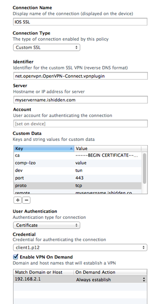

Many large organizations have existing VPNs in place, and the rise in development of enterprise mobile applications often requires that apps running outside the firewall need to "VPN in" before they are allowed to access any corporate resources.

While enabling a VPN is fairly easy on most mobile devices, I've found that many IT organizations would like to automate this such that the device automatically connects to the VPN when the Enterprise App or an internal Website is launched. Having gone through this with a couple of customers, I've put this post together to highlight how this can be done.

<span class="more"></span>

**Which VPN types support On Demand for iOS?**

iOS 4.2 introduced features designed for the enterprise. These features included several VPN clients (L2TP, PPTP, Cisco IPSEC), many of which can be configured to automatically initiate the connection based upon DNS requests for certain domains.

While this on demand feature has been around for a while, it does have a couple of caveats. Firstly, it's only available for SSL based VPNs. An SSL-based VPN is a connection that relies on a client/server side certificate for authentication. Having an SSL-based VPN means that the connection can be established without asking the user for credentials (e.g. a password or RSA token). Because an on-demand VPN could be connecting and disconnecting every few minutes, this makes sense as prompting the user could cause a jarring user experience. Secondly, the on demand VPN can only be setup using the iPhone Configuration utility. While you can create a VPN connection on iOS devices (under general/settings), it's not possible to create an SSL-based VPN or specify any of the on demand domains.

With this in mind, I'll be showing how to establish an On Demand VPN using OpenVPN and the OpenVPN client for iOS that was released earlier this year.

**Server-Side Setup**

The first step is of course to setup an OpenVPN server. If you don't have access to one already, there are plenty of guides to help you set one up. If you don't have access to a spare machine on the network, you can also use a Linux VM instance hosted on EC2, Azure, or any other hosting provider. This [article](http://holgr.com/blog/2009/06/setting-up-openvpn-on-amazons-ec2/) is a pretty good guide for setting this up on EC2 and the instructions should be able to be tailored to other hosting environments.

**Generating Certficates and Keys**

Once you have your OpenVPN server running, you'll need to either import or generate certificates and keys required to establish the connection. If you don't have access to certificates already, you can find some great documentation [here](http://openvpn.net/index.php/open-source/documentation/howto.html) on how to create your own using the EasyRSA project on Github. (Scroll down and look for instructions on using easy-rsa)

These are the certificates you'll need to generate using EasyRSA:

**ca.crt **(CA certificate required for both server and client)
**dh2048pem** (A 2048bit Diffie Hellman key that is required on the server)
**server.crt** (The server-side certificate)
**server.key** (The key for the server-side certificate)
**client1.crt** (The client-side certificate)
**client1.key** (The key for the client-side certificate)

**Configuring OpenVPN **

Place the certificates in a folder called keys (under /etc/openvpn/keys) and modify your /etc/openvpn.conf file to look similar to the following:

```
tls-server
port 443
proto tcp-server
dev tun
ifconfig 192.168.2.1 192.168.2.2
keepalive 10 120
comp-lzo
persist-key
persist-tun
verb 3
push "ifconfig 192.168.2.2 192.168.2.1"
push "redirect-gateway"
dh keys/dh2048.pem
ca keys/ca.crt
cert keys/server.crt
key keys/server.key
```

This should be fairly straightforward to understand from the documentation, especially if you've used OpenVPN before. As you can see, we are creating a peer to peer connection using two private IP addresses (192.168.2.1 and 192.168.2.2). Don't worry if these don't match your internal network on the OpenVPN box - they don't need to in order to get this up and running.

For the purposes of this article, I have the VPN running on a tcp:443 connect, but feel free to adjust the protocol and port to match your own environment (assuming that you have the necessary ports open on your Firewall).

Once you have the server configured, you can start OpenVPN:

```
openvpn --config /etc/openvpn/openvpn.conf
```

Assuming that the server starts OK, you can move to the next step.

**Installing and Configuring the Client**

The OpenVPN client can be found on the AppStore. At the time of writing it's version 1.0 build 47, which has a few bugs here and here, but still seems to work well.

After you have this installed, go ahead and install the iPhone Configuration Utility on your Mac. This can be found on the Enterprise iPhone Support page (http://apple.com/support/iphone/enterprise). Don't worry - although it's called the iPhone Configuration Utility, this will also work for setting up a VPN on an iPad device also.

After launching the utility, create a new configuration profile. In the general tab, enter the mandatory fields for name and identifier. Then, click on the credentials tab. We need to import the client certificate and key that was generated earlier using EasyRSA.

Unfortunately, the iPhone Configuration Utility (which we'll call IPCU from now on) doesn't support importing .CRT and .KEY files directly, so we'll need to generate a PKCS#12 file for use here. To do this, in the Terminal locate your client certificate and key files, and run the following command:

```
openssl pkcs12 -export -in client1.crt -inkey client1.key -out client1.p12
```

The result of this should be a .p12 file, that you can now import into the credentials section of IPCU.

Note:  When you generate the .p12 file, you will be asked for an export password for the file. Enter something, and use the same password in IPCU (there is a field just under the certificate picture). If you don't enter a password, you will likely get a profile error when you try to deploy this to the device.

With this done, now navigate to the VPN tab and create a new VPN connection. IPCU doesn't support including an OpenVPN config file, so we'll have to create the majority of the settings in this tab - this is where things get fun :-)

Give the connection a name, and select "Custom SSL" for the connection type. For the identifier, use the following:

```
net.openvpn.OpenVPN-Connect.vpnplugin
```

This is telling the VPN client that a specific bundle ID (the OpenVPN app) should be used for this connection.

Next, in the Server field, enter the DNS name or IP address for your OpenVPN server.

The Custom Data contains keys and strings that replicate what would have normally gone into a config.ovpn file. These are the entries that you will need:

ca - This is a tricky one to get right. We can't point it to a ca.crt file, because there is no way of bundling a file using the IPCU tool. To overcome this, open the ca.crt file in TextEdit and replace all of the newline/carriage returns with n. What you should end up with is a single (long) line of text that starts with -----BEGIN CERTIFICATE----- and has several lines delimitered by n ending with -----END CERTIFICATE-----. Once you have this, paste this entire line into the value for the ca key.

comp-lzo - enter the key, but you don't have to give it a value.

dev - set this to tun

port - set to 443

proto - set to tcp

(Again if you are using something other than TCP port 443, feel free to change)

remote - set to [your server name] 443

(replace your server name with the DNS name or IP address of your OpenVPN server)

verb - set to 3

Here's a quick screenshot of my profile:



That should wrap up the custom data piece.

Under User Authentication, select Certificate - and then under Credential select the client certificate from the drop down.

Finally, check the "Enable VPN On Demand" box, and in the below table enter the domain names or IP addresses for the hosts that VPN is required for. For this tutorial, I have a single entry for 192.168.2.1 with "Always Establish".

**That's it!**

This configuration should be enough to get VPN On Demand working with OpenVPN on the iOS client. To test, deploy the configuration profile to the device. Assuming that this works, open a browser and browse to 192.168.2.1 - this should invoke the VPN connection and forward the requests to the OpenVPN server. If you have a test page running on the OpenVPN server then this should be displayed in the browser.

**If it didn't work...**

There's a good chance that things won't work first time, just due the complexity of the setup.  Here are some of the common tips/tricks that I found during the process.

Firstly, the console window in IPCU will be your best friend. The most common error I saw was related to the CA certificate. If you get these, it likely means that your CA entry in IPCU is wrong. Go back and make sure you've correctly replaced the linebreaks with n's and retest.

There are a few "bugettes" in the iOS client. As of build 47 these include:

- The tcp-client param is not supported in the iOS client. Use tcp instead.

- The client expects ifconfig information to be pushed to it (using the push lines in the server config). It doesn't seem to be possible to configure ifconfig lines locally.

- The "redirect-gateway" seems to be required for the iOS client - whereas Tunnelblick connects without it.

Workflow. Getting VPN On Demand working right off the bat can be hard, especially if multiple parts of the configuration are wrong. If you are new to OpenVPN, you might want to setup a VPN with a the following configurations (in terms of complexity just to get working):

- OpenVPN w/ Secret Key - using Desktop machine (use Tunnelblick for the Mac)
- OpenVPN w/ Certificate - using Desktop machine
- OpenVPN for iOS w/ Certificate - using the actual OpenVPN for iOS Client (not IPCU)
- OpenVPN for iOS w/ Certificate - using IPCU 

Browser Refresh.  If it looks like everything is working (VPN established, etc.) but you still don't get your Web page, try refreshing the browser/making a 2nd request.  I'm not sure whether this is something in the config, or a "feature" of the OpenVPN client for iOS - but I've found that refreshing often helps brings the page to life after the VPN connection has been established.
