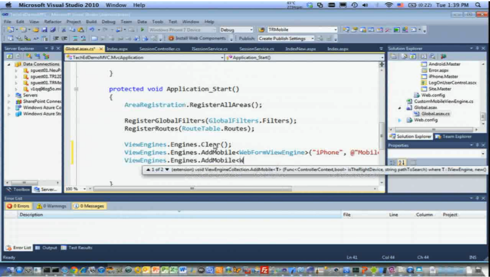

Following a few recent presentations, I've had a couple of people ask how I run Visual Studio on the Mac. 

You'll be sad to hear that I don't have a special version of Visual Studio for Mac OSX - instead I am using VMWare Fusion 3.1 to run a copy of Windows 7 in a virtual machine.

Fusion has a mode called "Unity" which allows windows from the virtual machine to interact with windows on the host operating system (even to the point where I can put icons for Windows-based applications in the dock on the Mac). There is a little performance hit running applications in this way vs. a full screen virtual machine, but it's certainly useful for presentations where you are flipping between both environments.

