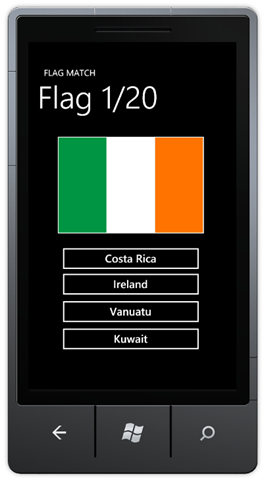
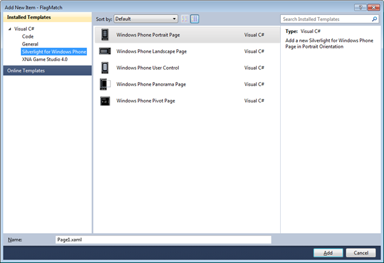
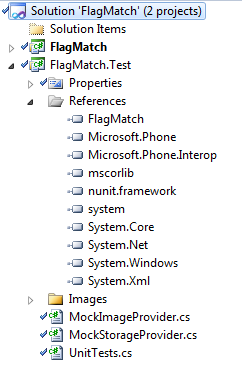
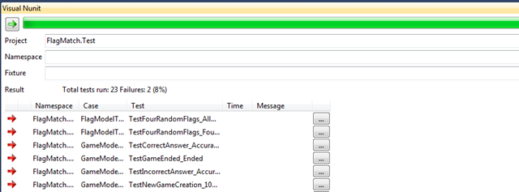
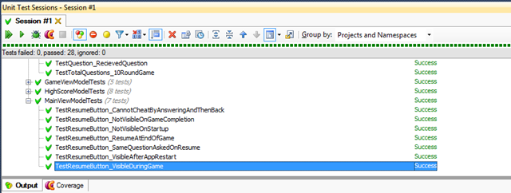
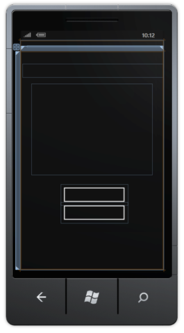
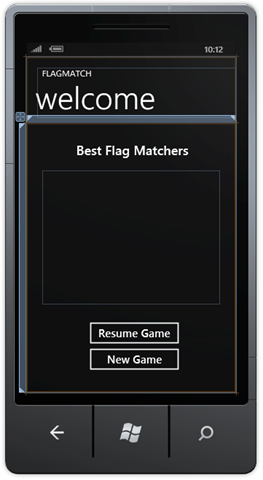
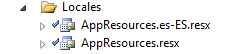
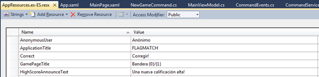
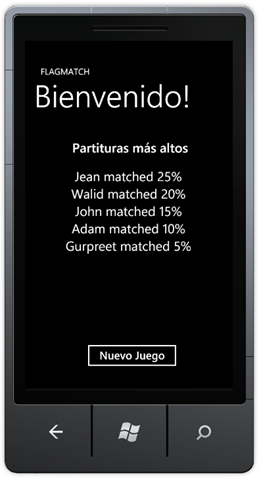

Kylen, my 6 year old son, is really into world flags. At home we have a sheet of around 200 flags from across the globe, and he’s pretty close at reciting all of them (and certainly much better than Mom and Dad!).

Spending a couple of hours over labor day last month, I set myself a task of building a “Flag Matching” application for Windows Phone 7 (WP7). My goal was twofold: Build a simple application that he can use (and that I can offer on the marketplace), and at the same time, look into some of the TDD best practices for developing a WP7 application.

<span class="more"></span>



The application itself is simple enough. As shown above, the player gets presented with a picture of a flag, and four possible countries (of which only one is correct). A game consists of 20 flags, and the application maintains a high score table.

During development of the application, this is what I found:

**Setting up TDD for Windows Phone 7**

As a new developer for Windows Phone 7, one of the first things you’ll quickly discover is that there is no option for a test project within the IDE. After creating a WP7 solution, I searched for the “WP7 Test Project” template, but to no avail...



A quick search on the Web will offer up a few alternatives and chances are, you’ll quickly reach Jeff Wilcox’s session on [Unit Testing Silverlight & Windows Phone Applications](http://live.visitmix.com/MIX10/Sessions/CL59) from MIX10\. This is a really good session, however the recommended approach (using a Silverlight-based unit test framework) can be somewhat limited.

In my opinion, although it works well for small numbers of tests, not having unit tests outside the emulator makes it difficult for large test suites, using any continuous integration, and integrating with the IDE.

If unit tests in the emulator don’t work for you either, here’s a workaround:

In your solution, create a new project of type **Windows Phone Class Library**.



Name it appropriately (I called mine **FlagMatch.Test**) and include a reference to the original Windows Phone project (**FlagMatch**). Add the [NUnit](http://nunit.org/) unit test framework library as a reference (I’m using v2.0.50727) and write your tests as you normally would (of course, specific to the NUnit syntax).
```cs
[TestFixture]
public class FlagModelTests
{
    [Test]
    public void TestFourRandomFlags_AllUnique()
    {
        Assert.AreEqual(4, Flag.FourRandom.GroupBy(f => f.Name).Select(f => f).Count());
    }
}
```

Once you have a set of tests, you can then integrate these within Visual Studio. I’ve had reasonable luck with [Visual NUnit](http://sourceforge.net/projects/visualnunit/), a free IDE plug in that works well with many versions of Visual Studio.



Alternatively, if you use [ReSharper](http://www.jetbrains.com/resharper/), you’ll find that their IDE integration works great also.



My preference is to use ReSharper as it works well with with another JetBrains product called [dotCover](http://www.jetbrains.com/dotcover/) – for which you can use to analyze test code coverage in your Windows Phone application.

Although you’ll find the majority of your unit tests will work great, you may well come across some strange errors. Most of these will be related to operations on the phone that cannot be replicated outside the emulator. For example, accessing isolated storage or referring to embedded resources/images as part of the project works well within the emulator, but not so much from a class library.

To get around this, you’ll need to create some mock objects to handle these operations. In my test project, I have a **MockStorageProvider** that I use in place of calls to isolated storage:

```cs
[Test]
public void TestResumeButton_NotVisibleOnStartup()
{
    MainViewModel viewModel = new MainViewModel(new MockStorageProvider());
    Assert.AreEqual(Visibility.Collapsed, viewModel.ResumeGameButtonVisibility);
}
```

As you can see, I pass the mock object to the view model (more on this in the next section) as an optional constructor parameter. All storage operations then use this MockStorageProvider instead of writing to isolated storage (which would have generated an exception during the tests). This also has the advantage that I can add additional tests within the mock object to ensure that the storage provider is being called correctly from the application.

**Using MVVM with WP7**

For anyone with experience of testing Silverlight projects, you’ll know that although XAML provides a code separation layer, testing parts of the UI (e.g. actions when a button is pressed) can still be difficult. This can be overcome by using a pattern called [MVVM](http://en.wikipedia.org/wiki/Model_View_ViewModel) (Model View ViewModel). I’m not going to go into the details of MVVM here (there are plenty of other resources that do a great job) other than to say it can be used for WP7 applications with a little tweaking. The core reason is that WP7 is based largely on the SL3 codebase, which does not contain a complete commanding event model.

There are a couple of approaches in order to get MVVM working on WP7\. The first would be to reuse one of the existing samples/libraries available today. Your mileage may vary (as I found some were designed for pre-RTM versions), although I’ve heard good reviews about Laurent Bugnion’s [MVVMLite](http://galasoft.ch/mvvm/getstarted/) project.

If instead you’d like to learn how implement this yourself, here is how I achieved it:

First, you should create a view model base. Assuming you are going to have multiple view models (I ended up with one per page), it’s a good idea.

```cs
public class ViewModelBase : INotifyPropertyChanged
{
    public event PropertyChangedEventHandler PropertyChanged;

    public void NotifyPropertyChanged(String propertyName)
    {
        if (PropertyChanged != null)
        {
            PropertyChanged(this, new PropertyChangedEventArgs(propertyName));
        }
    }
}
```
Next, create your view model, inheriting from ViewModelBase.

```cs
public class MainViewModel : ViewModelBase
{
    public string NewGameButtonTitle
    {
        get { return AppResources.NewGameButtonTitle; }
    }

    public NewGameCommand NewGameButton
    {
        get
        {
            return new NewGameCommand();
        }
    }
}
```

For the purposes of this sample code, let’s imagine that we have a single page with a “New Game” button. As you can see above, the view model contains two properties – one for the title of the button, the second for the command that this button will be bound to.

In order to implement the commands, you’ll need a couple of things. The first is a command service:
```cs
public static class CommandService
{
    private static readonly DependencyProperty _commandProperty;

    static CommandService()
    {
        _commandProperty = DependencyProperty.RegisterAttached("Command", typeof(ICommand), typeof(CommandService),
        new PropertyMetadata(OnCommandChanged));
    }

    public static ICommand GetCommand(DependencyObject dependencyObject)
    {
        return (ICommand)dependencyObject.GetValue(_commandProperty);
    }

    public static void SetCommand(DependencyObject dependencyObject, ICommand value)
    {
        dependencyObject.SetValue(_commandProperty, value);
    }

    private static void OnCommandChanged(DependencyObject dependencyObject, DependencyPropertyChangedEventArgs dpceArgs)
    {
        if (dependencyObject is Button)
        {
            string parameter = dependencyObject.GetValue(_commandProperty).ToString();
            Button button = (Button)dependencyObject;
            ICommand command = (ICommand)dpceArgs.NewValue;
            button.Click += delegate(object sender, RoutedEventArgs arg) { command.Execute(parameter); };
        }
    }
}
```

There are a good number of examples of this around (just search for MVVM) – this one I found in a great post from the [Coding Solutions](http://codingsolutions.blogspot.com/2010/03/steps-to-run-windows-phone-7-unit-test.html) blog.

After this, you’ll need to create event handlers. Here’s a simple handler for when the new button is pressed.
```cs
public class CommandEvents
{
    public static EventHandler NewGameButtonPressed;
}
```

Your command itself simply implements the ICommand interface:
```cs
public class NewGameCommand : ICommand
{
    public NewGameCommand()
    {
    }

    public bool CanExecute(object parameter)
    {
        return true;
    }

    public event EventHandler CanExecuteChanged;

    public void Execute(object parameter)
    {
        if (this.CanExecute(null))
        {
            if (CommandEvents.NewGameButtonPressed != null)
            {
                CommandEvents.NewGameButtonPressed(this, new EventArgs());
            }
        }
    }
}
```

With all these in place, you can now bind the command to the actual button in your XAML file. On your XAML page, you’ll need to add the following namespace:
```xml
<pre style="clear: both">xmlns:Commands="clr-namespace:FlagMatch.Commands"</pre>
```

And on the button itself, simply bind to the command using the following:
```
button name="button1" margin="134,505,0,0" verticalalignment="Top" commands:commandservice.command="{Binding Path=NewGameButton}" content="{Binding NewGameButtonTitle}" height="72" horizontalalignment="Left" width="227"
```

Notice how the content of the button is bound to the **NewGameButtonTitle** in the view model, and the command is bound to the **NewGameButton** command. More importantly, notice also how there are no traditional event handlers needed here.

The final piece of the puzzle is to register the view model and the button event handler in the XAML code behind. To do this, in the code behind, we create an instance of the view model:
```cs
private readonly MainViewModel _mainViewModel = new MainViewModel();
```

Then in the constructor, bind the view model to the datacontext and register the button event handler.
```cs
LayoutRoot.DataContext = _mainViewModel;
CommandEvents.NewGameButtonPressed += new EventHandler(StartGame);
```

The StartGame method simply performs a navigate action for us. This is something that just can’t be moved into the view model.

```cs
private void StartGame(object sender, EventArgs e)
{
    NavigationService.Navigate(new Uri("/GamePage.xaml", UriKind.Relative));
}
```

Other than that, there is no additional UI logic required in code behind – which means for a slightly more complex implementation, but one that provides great test coverage.

A final point worth noting is designer support. As you start building out controls using the MVVM paradigm, you’ll likely find that the designer ends up being difficult to use.



Because we are binding content directly to the view model, the designer doesn’t know where to pick up values to be shown at design time. Fortunately, there is a way around this. Simply add a reference to the view model in your App.xaml file:

```xml
<local:mainviewmodel x:key="MainViewModel" xmlns:local="clr-namespace:FlagMatch.ViewModels"></local:mainviewmodel>
```

Rebuild the project, and you’ll see that the designer picks up the default values from a instance of the view model class:



**Localization and MVVM**

Finally, I wanted to make sure that my MVVM model could be used for multiple languages.

You may have noticed that in the previous code sample, the title of the button is returned as **AppResources.NewGameButtonTitle** (instead of returning “New Game”).

```cs
public string NewGameButtonTitle
{
    get { return AppResources.NewGameButtonTitle; }
}
```

This is to make localization easy (well... easier!). Under my **Locales** namespace there are two files:



**AppResources.resx** is a resource file that contains default (in my case English) string values. In there, you’ll find that **NewGameButtonTitle** refers to a string called “New Game”.

As you may have guessed, **AppResources.es-ES.resx** is the Spanish version of this resource file. In there, you’ll find that **NewGameButtonTitle** refers to a string called “Nuevo Juego”

In order to enable the Spanish localized version, we need to do a few things:

Firstly, create separate resource files for all your languages, using the **AppResources.[lang].resx **format as stated above.

Next, in the .resx file, ensure that the access modifier is set to public.



(Otherwise, you’ll find that it just doesn’t offer the localized version).

Them edit your .csproj file outside Visual Studio (using Notepad or similar). Add the supported country code in the **SupportedCultures** tag.
```xml
<supportedcultures>es-ES</supportedcultures>
```

Save the file and reload the project in Visual Studio.

Once this is done, deploy the application to the emulator, and set the language of the emulator appropriately (Settings / Region and Language / Display Language). The emulator will restart.

Finally, test your application. You should find that the new language strings are now used:



(My Spanish isn’t that good, so apologies for any mistakes above!).

One word of caution: The testing process on the Windows Phone Marketplace is strict when it comes to supporting multiple languages. If you submit an application that supports multiple languages, you really need to make sure that _all_ strings are localized (and you provide localized screenshots and product descriptions) in order to pass the testing certification.

**Update: I've recently moved the source code for the project - you can now find it on http://github.com/simonguest/flagmatch**

