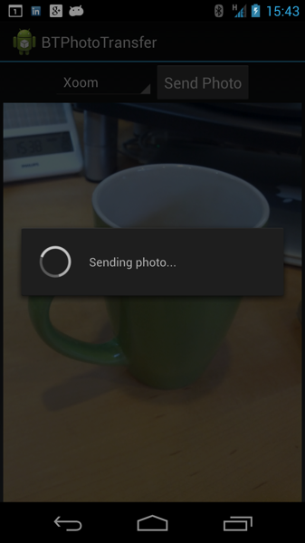
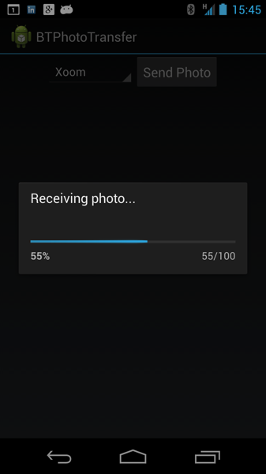

Recently, I've been working on some code to transfer images and other data between Android devices using Bluetooth.  While I could have used the Basic Imaging Profile (BIP) of the Bluetooth 4.0 specification, this particular application has specific requirements that would have been difficult to implement using BIP.  To overcome this, I ended up building an application that instead relies on the Serial Port Profile (SPP), exchanging data using the RFCOMM protocol.  

The SPP implementation on Android is nice, but only offers the fundamentals of an InputStream and OutputStream.  While this provides the basics of sending and receiving bytes, it doesn't handle data integrity, progress updates, threading, or any of the other requirements often needed when sending data between two devices.

The result from my recent work is an Android library called [android-btxfr](http://github.com/simonguest/android-btxfr), which I'm happy to share through my Github repository.  android-btxfr is lightweight library designed to send and receive any type of data between Android (API 15 and higher).  It can be used to exchange text, files, photos, videos, sounds, and literally any other type of binary data.  The library supports anything that can be put into a byte stream and includes digest checking to ensure data integrity.

The library exposes two thread types (ClientThread and ServerThread) depending on whether you are sending or receiving data.

Receiving data is easy. Simply run the server thread, passing the paired bluetooth device and handler. The handler will be then called with the following messages:

**DATA_PROGRESS_UPDATE** - Data is being received by the other device. The message contains the progress of the data being received.
**DATA_RECEIVED** - Data has been fully received from the other device. The message will contain the actual payload (a byte stream of the image, video, etc.)

There are other message types to handle failure conditions.

The client thread works in a similar fashion. To send data, invoke the client thread, passing the paired bluetooth device and handler. The handler will be called with the following messages:

**READY_FOR_DATA** - Indicates that the connection has been established, and data can be sent.
**SENDING_DATA** - Indicates that data is being sent to the other device.
**DATA_SENT_OK** - Indicates that the recipient received the payload.

Again, there are other message types to handle failures.

To show all of this in action, I've put together a sample application, which can be found [here](http://github.com/simonguest/btphototransfer-sample).  This app uses the android-btxfr library to send captured photos between devices. 

