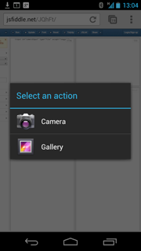
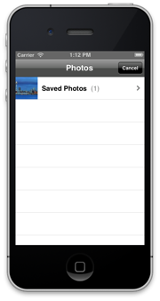

Here at Neudesic, we're fortunate to be involved in many exciting HTML5/Mobile Web applications for different organizations. For many of these projects, one of the common requests, especially for field-facing mobile applications, is the ability to upload a photo from within a web page in a mobile browser.

<span class="more"></span>

If you are not familiar with the space, you may think this should be default behaviour, but surprisingly uploading media is one of those areas that is still going through the standardization process. Eric Bidelman has a [great overview](http://www.html5rocks.com/en/tutorials/getusermedia/intro/) of the three "rounds" of standardization that have taken place so far as part of the [Device API working group](http://www.w3.org/2009/dap/).

**What can you do today?**

While Eric's article gives a great overview of what's likely to come, the purpose of this post is to explore what's possible today, outlining the relative pros and cons of each approach.

Firstly, let's take a look at what's supported out of the box:

**Android**

If you are using Android 3.x+ (i.e. either Android tablets running Honeycomb or later, and Android phones running ICS) - or users are running Chrome or Firefox Mobile for Android, the browser will support an input element that can invoke the camera:

```html
<input type="file" accept="image/*" capture="camera">
```

Simply add this element to your web page, and together with some server-side processing for the upload, users can upload the image from their device.



As Eric mentions in his article, it does look like things are heading towards _getUserMedia()_ instead. Although this new API works with latest versions of the desktop version of Chrome, we haven't found anything that works on mobile browsers as of yet.

**iPhone/iPad**

Unfortunately, the input element above does not work on Mobile Safari on iOS5 today - the experience for the user is just a disabled button. This is true for the recently released version of Chrome for iOS also (as it's just a wrapper over UIWebView).

Things are changing however.  At WWDC this year, Apple publicly announced support for photo and video uploads within Mobile Safari shipping with iOS 6\. It's difficult to say much more about the implementation here (as the developer/beta programs are under NDA), but if you have access to Apple's developer program, it's definitely worth checking out.

**Apache Cordova (PhoneGap)**

If you want to support earlier Android versions, and/or can't wait for iOS 6, arguably the most popular choice is Apache Cordova (previously known as PhoneGap). Apache Cordova provides a native wrapper around HTML-based content, and supports several platforms today - including iOS and Android. The Cordova API supports media capture, and with a couple of lines of JavaScript, it's possible to instantiate the camera or invoke the camera rolls within your Mobile Web application.



**Pros:** Works with the most popular versions of mobile browsers, and as of now, Cordova provides a good user experience for the user. The user presses a "add photo" button in the HTML application, and the native wrapper invokes the camera control without the user needing to know whats going on. If using the camera roll, the API also supports the option of uploading multiple photos.

**Cons:** Using Cordova does however change the deployment model for the application. No longer can you just visit a Web site to use your application - you now need to think about distributing your application - either via the AppStore for public-facing applications or through another channel for enterprise apps.

In addition to the deployment, Cordova also introduces several options that need to be considered for actually transfering the image to the site. The default is to use Base64 encoding, which is good for small images, but we've experienced performance problems on large images from 5MP+ cameras. The Cordova API does support a File Transfer API, which works well except it doesn't yet support authentication, so you'll need to create an anonymous area to post your photos to. If you do need authentication, you'll want to send the photo directly after capture, which will likely mean writing a custom Cordova plug in and using NSUrlConnection to send your photo to the server.

**Companion Application**

An alternative approach to wrapping your HTML content with native code is to ship a "companion application" responsible for uploading the photo.

Both iOS and Android support custom URL schemes, which means that applications can respond to different URL requests from the browser. For example, I can create a native application responsible for taking and uploading pictures, using a custom URL scheme called simonphoto:// which I can then pass various parameters - for example, the ID of a project that I'm uploading photos for. Once the user clicks on the simonphoto:// link within the mobile browser, the application launches and I can take and upload as many photos as I want.

**Pros:** The biggest draw to this approach is that the HTML application doesn't need to be wrapped with any native code.

**Cons:** While I don't have to wrap my HTML, the user still needs to obtain the companion application, which will likely involve a trip to the AppStore or other link for download. In addition, even when the companion application is downloaded, the user experience isn't quite as slick as the the PhoneGap approach. For example, in iOS there is no natural way of getting back to the Web app once the native application is ready to hand back control (unless you pass a return or app id in the parameters). Also, there is no way of checking whether the companion application is installed or not from the Web page.

**Picup**

[Picup](http://picupapp.com) is an example of a free companion app that works in a similar way as outlined above. It uses the fileupload:// URL scheme to invoke the Picup app, which much be installed.


**Pros: **As above.

**Cons:** As above. No version for Android (although I'm sure there are equivalent apps available).

**Email**

Finally, a very simple approach, but one that I've seen a couple of people use is sending the photo via email. Your application has a "mailto" link which includes a subject (maybe the ID corresponding to the application) and body that reads "Please remember to attach your photo". The user attaches the photo manually and it's sent to a server-monitored email store for processing.

**Pros: **Nothing native here, and deployment model stays the same.

**Cons: **Funky experience for the user. You'll also need to setup a server side environment to handle the incoming emails, strip the attachments, and correlate with your application.

**Summary**

A lengthy post, but hopefully it gives you an overview of how to do photo upload from mobile devices today. To summarize:

If you are writing an application that won't be released for a few months, and will primarily target Android ICS and iOS6, you should be able to use the input element outlined above to invoke the camera and upload a picture. If you do this, make sure you understand the transition to getUserMedia as the specifications mature.

If you are writing an application that needs to target today's platforms - namely Android 2.x and iOS5, you'll either need to use Cordova to create a wrapper or a companion application (either hand crafted, or something like Picup). Choosing between Cordova and a companion application is a balance of user experience vs. deployment. A Cordova application will keep the user experience seamless, but you will be responsible for the deployment of the application as a result.

If you don't want to do any device development, and are just looking to provide a shortcut for users to send photos, you could consider the basic mailto: / email link approach.
