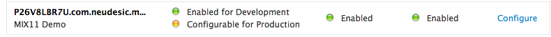
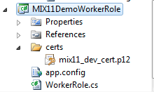

In my [MIX11 session](http://channel9.msdn.com/events/MIX/MIX11/EXT18) last week I demonstrated how to create push notifications to iPhone and iPad devices from Wndows Azure.  I’ve put together this blog post to share more detail and the source code for how this works.

<span class="more"></span>

Firstly, if you haven’t already, you will need to register your iPhone/iPad application for push notifications.  To do this, log into the iOS developer center (you’ll need to be a registered Apple Developer) and in the provisioning portal setup a new App ID, enabling it for push notifications.  Here’s the App ID for my MIX demo:



With the development certificate that you downloaded during this process, create a new Azure worker role and import the certificate into a folder called “certs”:  In addition, you’ll need to configure the properties of the certificate file such that the build action is set to “Content”.



(I’ve deliberately skimmed over the previous points of creating and App ID and Azure Worker role as they are both well documented by Apple and Microsoft).

To start configuring the worker role for push notifications, first add a reference to the Windows Azure Storage Client (Microsoft.WindowsAzure.StorageClient) library.  In the OnRun section of the worker role, access the Azure queue that messages are going to be placed in.  

```cs
StorageCredentials creds = new StorageCredentialsAccountAndKey("YOUR ACCOUNT NAME", "YOUR ACCOUNT KEY");
CloudQueueClient cqc = new CloudQueueClient(""YOUR QUEUE URL”, creds);
var testQueue = cqc.ListQueues().First(q => q.Name.StartsWith("YOUR QUEUE NAME"));
```

Then, still within the OnRun method, create a routine that checks the queue for incoming messages and sets up the connection to the APN (Apple Push Notification) service.

```cs
while (true)
            {
                Thread.Sleep(10000);
                if (testQueue.RetrieveApproximateMessageCount() != 0)
                {
                    List<cloudqueuemessage> messages = testQueue.GetMessages(testQueue.RetrieveApproximateMessageCount()).ToList();
                    foreach (CloudQueueMessage message in messages)
                    {
                        Trace.WriteLine("Retrieved message from Queue: " + message.AsString);
                        // open the APN connection
                        InitializeAPN();
                        // send message
                        string session = message.AsString.Substring(0, message.AsString.IndexOf(':'));
                        SendAPNMessage(message.AsString, session);
                        // tear down the APN connection
                        CloseAPN();
                        testQueue.DeleteMessage(message);
                    }
                }
            }
```

You’ll probably want to do something a little more elegant than “while (true)” but this works for the purposes of this post.  Also, as I mentioned in the talk, you may or may not want to setup and tear down the connection to the APN for each message that you send.  If you are planning to send a large volume of messages to a large number of devices, Apple may view this as a denial of service attack and refuse your connection.  A more prescriptive approach in this scenario would be to instead open the connection in the OnStart method and keep it alive during OnRun.

Within the worker role, setup the following declarations.  Most of these should be straightforward, and you’ll need to replace a number of them with your own details.  

```cs
private static string HOST = "gateway.sandbox.push.apple.com";
private static int PORT = 2195;
private static string CERT_PASSWORD = "YOUR PASSWORD";
private static X509Certificate2 CLIENT_CERT = new X509Certificate2(Environment.GetEnvironmentVariable("RoleRoot") + @"approotcertsmix11_dev_cert.p12", CERT_PASSWORD);
private static X509Certificate2Collection CLIENT_CERT_COLLECTION = new X509Certificate2Collection(CLIENT_CERT);
private static string DEVICE_TOKEN = "YOUR DEVICE TOKEN";  //Replace this with the Device token we obtain later on in this example
private TcpClient client;
private SslStream sslStream;
```

With these declarations in place, we can now start writing the APN code.  First, create an IntializeAPN method, responsible for setting up the connection to the APN.

```cs
private void InitializeAPN()
{
    client = new TcpClient(HOST, PORT);
    sslStream = new SslStream(client.GetStream(), false);
    try
    {
        sslStream.AuthenticateAsClient(HOST, CLIENT_CERT_COLLECTION, SslProtocols.Tls, false);
    }
    catch (AuthenticationException ex)
    {
        Trace.WriteLine("Could not open APN connection: " + ex.ToString());
    }
    Trace.WriteLine("APN connection opened successfully.");
}
```

Then, create a method called SendAPNMessage which will construct and sent the push notification message in the correct format.  

```cs
private void SendAPNMessage(string message, string session)
        {
            try
            {
                MemoryStream memoryStream = new MemoryStream();
                BinaryWriter binaryWriter = new BinaryWriter(memoryStream);

                // construct the message
                binaryWriter.Write((byte)0); 
                binaryWriter.Write((byte)0);  
                binaryWriter.Write((byte)32); 

                // convert to hex and write
                byte[] deviceToken = new byte[DEVICE_TOKEN.Length / 2];
                for (int i = 0; i < deviceToken.Length; i++)
                    deviceToken[i] = byte.Parse(DEVICE_TOKEN.Substring(i * 2, 2), System.Globalization.NumberStyles.HexNumber);
                binaryWriter.Write(deviceToken);

                // construct payload within JSON message framework
                String payload = "{"aps":{"alert":"" + message + "","session":""+session+"","badge":1}}";

                // write payload data
                binaryWriter.Write((byte)0);                 
                binaryWriter.Write((byte)payload.Length);     
                byte[] payloadBytes = System.Text.Encoding.UTF8.GetBytes(payload);
                binaryWriter.Write(payloadBytes);
                binaryWriter.Flush();

                // send across the wire
                byte[] array = memoryStream.ToArray();
                sslStream.Write(array);
                sslStream.Flush();
            }
            catch (Exception ex)
            {
                Trace.WriteLine(ex.ToString());
            }
            Trace.WriteLine("Message successfully sent.");
        }
```

You’ll notice that my SendAPNMessage method signature contains a “session” value.  For the purposes of the demo, I was sending across the session code that had changed as an explicit value in the notification message.  Feel free to change or remove this as you need.

Finally, the close method is called to close the connection.
```cs
private void CloseAPN()
{
    client.Close();
}
```

At this point, you might be wondering how you obtain the DEVICE_TOKEN value for the above.  This is not the UDID of the device, but instead a separate token that is generated by the phone itself.  To get this token, and to handle incoming push notifications, let’s turn our attention to the XCode project.  For my demo I was receiving push notifications within a [PhoneGap](http://www.phonegap.com) application, but this code will work equally in a regular native client application.

First, we need to instruct the application to register for APN messages.  This is done using the registerForRemoteNotificationTypes method.  You’ll need to call this method when the application first starts up (for PhoneGap projects, this can be in the init method of the AppDelegate).

```objectivec
NSLog(@"Registering for APN");
[[UIApplication sharedApplication] registerForRemoteNotificationTypes: (UIRemoteNotificationTypeAlert | UIRemoteNotificationTypeBadge | UIRemoteNotificationTypeSound)];
```

This method has three callbacks that it can take advantage of.  One to indicate that registration was successful (we also get the Device ID from here), one to indicate that something went wrong (e.g. if we are running in the simulator, which doesn’t support push notifications), and one for when we actually receive a message).

The first two are easy to handle:
```objectivec
- (void)application:(UIApplication *)app didRegisterForRemoteNotificationsWithDeviceToken:(NSData *)deviceToken {
    NSString *str = [NSString stringWithFormat:@"Device Token=%@",deviceToken];
    NSLog(@"%@",str);
}

- (void)application:(UIApplication *)app didFailToRegisterForRemoteNotificationsWithError:(NSError *)err {
    NSString *str = [NSString stringWithFormat: @"Error: %@", err];
    NSLog(@"%@",str);   
}
```

Note how the first method (didRegisterForRemoteNotificationsWithDeviceToken) is where we actually extract the DEVICE_TOKEN string required in the worker role.  You’ll have to run this once, and copy and paste appropriately.  Of course, in a production environment, we would likely pass this value to the service via a separate call.  

The third callback gets called when the device actually receives a message.
```objectivec
- (void)application:(UIApplication *)application didReceiveRemoteNotification:(NSDictionary *)userInfo {
    for (id key in userInfo) {
        NSLog(@"key: %@, value: %@", key, [userInfo objectForKey:key]);
        NSString *payload = [NSString stringWithFormat:@"%@",[userInfo objectForKey:key]];
       
        // work out the session code from the JSON payload
        NSRegularExpression* regex;
        NSTextCheckingResult* result;
        NSError* error = nil;
        NSString* regexStr = @"session = ([^']*);";
        NSString* value = nil;
        regex = [NSRegularExpression regularExpressionWithPattern:regexStr options:NSRegularExpressionCaseInsensitive error:&error];
        result = [regex firstMatchInString:payload options:0 range:NSMakeRange(0, payload.length)];
       
        if(result && [result numberOfRanges] == 2)
        {
            NSRange r = [result rangeAtIndex:1];
            value = [payload substringWithRange:r];
        }

        if(value)
        {
            NSLog(@"Found session value in payload: %@",value);
            NSString* jsString = [NSString stringWithFormat:@"handleOpenURL("[http://URLHERE.cloudapp.net/Session/Lookup?session=%@");",value];](http://URLHERE.cloudapp.net/Session/Lookup?session=%@");",value];)
            [webView stringByEvaluatingJavaScriptFromString:jsString];
        }
    }       
}
```

As you can see above, this method parses the payload of the message, tries to work out the session code, and if one is found, creates a new javascript call to a method called handleOpenURL which instructs PhoneGap to call the method of the same name.  Of course, you are going to want to configure this for your own scenario, but hopefully this gives you a sense of how to pass a value as part of the message, and then take an action on that accordingly.  

Well, that wraps up this post.  I hope you enjoyed the talk at MIX, and that this code is useful if you have services in Windows Azure that have a need to push notification messages to iPhone and iPad devices.