At the end of August, Microsoft [published](http://www.zdnet.com/blog/microsoft/microsoft-rolls-out-windows-azure-toolkit-for-android/10503) the Windows Azure Toolkit for Android. At Neudesic, the partner behind developing the both toolkits for iOS and Android, we've been working with customers that use the toolkit to connect mobile applications to the cloud. One of the recent requests however has been to provide a walkthrough of getting started with the toolkit. The current build on [GitHub](http://github.com/microsoft-dpe) was released for a specific version of Eclipse and the Android tools, and as a result, can be a little challenging getting the library and sample code up and running. In this post, I'll explain what it takes to download the toolkit, create a brand new environment in Eclipse, and get started quickly with the toolkit.

 <span class="more"><span>

**Getting Started – What You'll Need**
  
Firstly, there is a list of tools that you'll need to download.
  
1. **Eclipse.** Download from http://eclipse.org – we'll be using Helios in this tutorial.

2. **JDK. ** We'll be using the default that ships with Mac OSX, but if you are on a PC, you'll need JDK 1.6 or higher.

3. **Android SDK and Eclipse Tooling.** Download the Android SDK from http://developer.android.com (we are using r14 for this walkthrough). Also follow the instructions for configuring the Android tooling within Eclipse. After you have installed everything, use the AVD manager to setup a new AVD for an Android 2.3.3 device.
  
**Setting Up the Library in Eclipse**

To import and build the library in Eclipse, perform the following steps.

Download the Windows Azure Toolkit for Android from GitHub. If you have the Git client installed, you can use this command:
  
```
git clone https://github.com/microsoft-dpe/wa-toolkit-android
```
  
Otherwise, go to the site and pull down the zip file of the repo.
  
Create a new directory for your Eclipse workspace:
  
```
mkdir wa-toolkit-android-workspace
```
  
Launch Eclipse, and point the default workspace to this newly created directory:
  
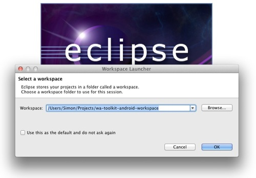

Create a new Android project called **AzureLibrary**, set the target to Android 2.3.3, use **com.microsoft.cloud.android** as the package name, but do not create an activity or test project.
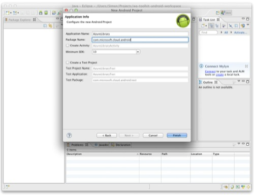

Right click on the AzureLibrary project and select **Import**. Choose **General** / **File System** as the import source, and click on **Next**.

Browse to the /library/src/com folder in the toolkit folder that you downloaded from GitHub.

Click on the **Browse (into folder) **button and select the src folder under your project. Expand the **src** folder, and check the **com **folder as shown in this screenshot:
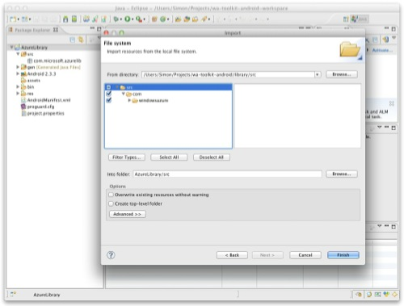

Click on the Finish button. The import will complete.
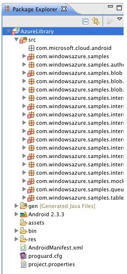

Right click on the project, select properties, and change the Java compiler version from 1.5 to 1.6\. (The default is 1.5, yet the toolkit uses many constructs only supported in 1.6)
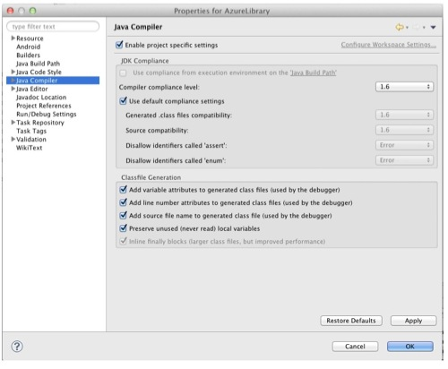

Click OK, and say **yes** to rebuilding the project. The project should now build with no errors.

Assuming everything builds correctly, right click on the project, and select Properties again. Go to the Android setting, and click on the **Is Library** check box.
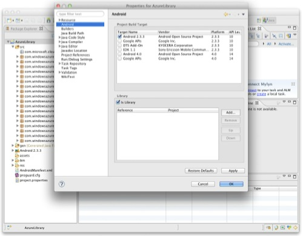

**Setting Up the Sample Application in Eclipse**

To import and build the sample application in Eclipse, perform the following steps:

Create a new Android project called **AzureSample**. Select Android 2.3.3, set the namespace to **com.windowsazure.samples.sample**, and choose not to create an activity.
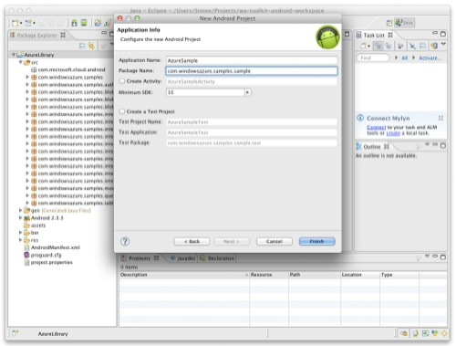

As you did with the library, right click on the project, and select **Import**. Select the **/samples/simple/src** as the source and import into the **AzureSample/src** folder.
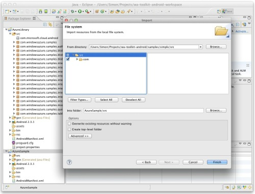

Right click on the project, select **Properties**, select **Android** and add a reference to the **AzureLibrary** project:
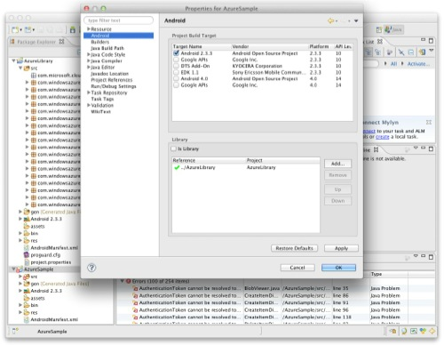

Right click on the project, select **Import**. Import from the **/samples/simple/res** folder into the **AzureSample/res** folder. This will import the resources required for the sample application.
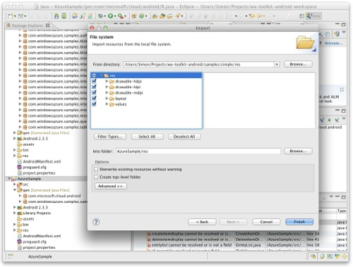

Answer **yes **when prompted to overwrite the **main.xml** file.

Right click on project, select **Import** and select the file system again. Select the **AndroidManifest.xml** from the root of the source directory and import into the root of the destination project.
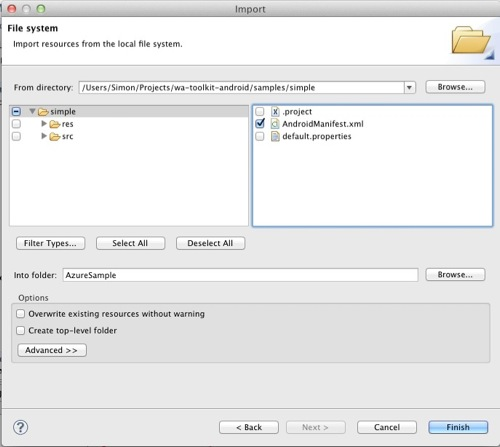

The Sample project should now build with no errors.

**Configuring your Windows Azure Account Name and Key**

In order to setup the sample project, you need to supply your account name and key, as provided by Windows Azure. You can obtain this by logging into the Windows Azure Portal (http://windows.azure.com) and navigating to Storage Accounts to obtain the details.

When you have the name and key, perform the following:

In the sample project, open **ProxySelector.java** from the **src/com.windowsazure.samples.sample** package.
At the top of the file replace the **ACCOUNT** and **ACCESS_KEY** values with the account name and access key for your Azure storage account.

**Running the Sample**

To run the sample, right click on the sample project, select **Run As / Android Application.**

Once the emulator is up and running, unlock the device.

Refer to the LogCat/Console window in Eclipse if there are any errors.

Click on the Start button in the sample application.

Select either table, blob, or queue storage and browse the storage associated with your Windows Azure account.
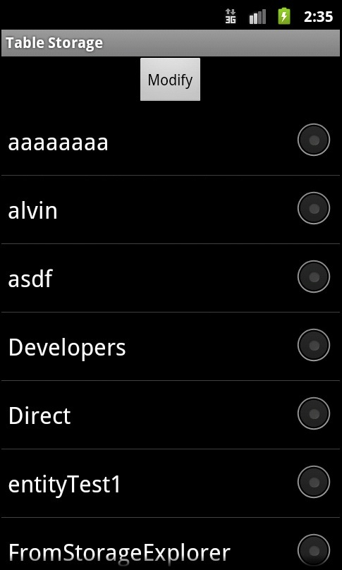

That’s it! Your sample application is now up and running, and you are able to browse Windows Azure storage!